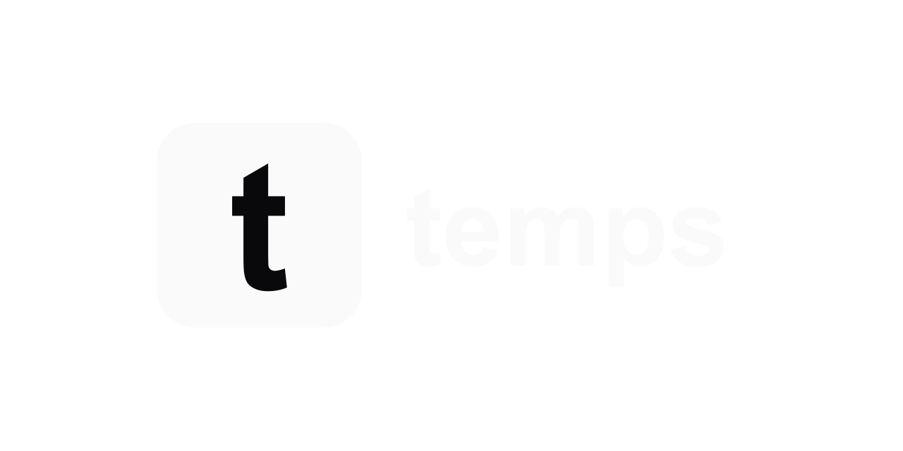

<div align="center">

<picture>
  <source media="(prefers-color-scheme: dark)" srcset="web/public/logo/temps-logo-dark.png">
  <source media="(prefers-color-scheme: light)" srcset="web/public/logo/temps-logo-light.png">
  
</picture>

**La alternativa open source a Vercel + Sentry + PostHog + Pingdom + Resend + E2B.**
Despliegues, analítica, session replay, error tracking, monitorización de disponibilidad, email transaccional y sandboxes de IA -- en un único binario autoalojado.

**Nativo para IA:** más de 440 operaciones de CLI y skills listas para Claude Code, Codex y OpenCode.

[](LICENSE)
[](https://github.com/gotempsh/temps/releases)
[](https://www.rust-lang.org/)
[](https://github.com/gotempsh/temps)

[Sitio web](https://temps.sh/?utm_source=github&utm_medium=repo&utm_content=header_es) · [Documentación](https://temps.sh/docs?utm_source=github&utm_medium=repo&utm_content=header_es) · [Inicio rápido](https://temps.sh/docs/introduction?utm_source=github&utm_medium=repo&utm_content=header_es) · [Discusiones](https://github.com/gotempsh/temps/discussions) · [Contributing](CONTRIBUTING.md)

[English](README.md) | [简体中文](README.zh-CN.md) | Español | [Français](README.fr.md) | [Deutsch](README.de.md) | [日本語](README.ja.md) | [Português](README.pt-BR.md)

</div>

---

```bash
curl -fsSL https://temps.sh/deploy.sh | bash
```

<picture>
  <source media="(prefers-color-scheme: dark)" srcset="assets/screenshots/create-dark.png">
  
</picture>


Deja de pagar 7 herramientas SaaS distintas. Temps sustituye tu plataforma de despliegue, analítica web, seguimiento de errores, reproducción de sesiones, monitorización de disponibilidad, email transaccional y sandboxes de ejecución de código para IA -- todo autoalojado, todo en un solo binario.

---

## Características

### Nativo para IA — más de 440 operaciones que un agente puede ejecutar

Cada operación del panel es también un comando de la CLI — **más de 440 repartidos en 69 grupos** — y Temps incluye las [skills](skills/) que enseñan a un agente a usarlos. Ponlas en **Claude Code**, **Codex**, **OpenCode** o cualquier harness que lea `.claude/skills/`, y tu agente podrá desplegar, revisar trazas, ejecutar migraciones o añadir un dominio sin que escribas el pegamento.

```bash
bunx @temps-sdk/cli projects list
bunx @temps-sdk/cli deploy my-app --environment production
bunx @temps-sdk/cli analytics ai-agents -p my-app --period 7d
```

Temps también ejecuta esos agentes por ti: los sandboxes de workflows lanzan Claude Code, Codex u OpenCode sobre tu repositorio, con las skills y los servidores MCP de la plataforma inyectados automáticamente.

### AI Chat — basado en tu propia telemetría

Pregunta por tu proyecto y la respuesta sale de tus datos — trazas, métricas, alarmas, despliegues e ingresos — no de la suposición de un modelo genérico. Es **de solo lectura por defecto**: las acciones de escritura son opt-in y, aun así, el asistente propone el cambio y espera tu confirmación.

<picture>
  <source media="(prefers-color-scheme: dark)" srcset="assets/screenshots/ai-chat-dark.png">
  
</picture>

### AI Gateway — un endpoint, tus propias claves

Trae tus propias claves de proveedor (OpenAI, Anthropic, xAI, Google Gemini) y llámalas todas a través de un único endpoint compatible con OpenAI — cambia la base URL y sigue usando el SDK que ya tienes. Las claves quedan cifradas en tu servidor, y cada petición queda atribuida: tokens, latencia, tasa de error y coste estimado por modelo.

<picture>
  <source media="(prefers-color-scheme: dark)" srcset="assets/screenshots/ai-gateway-dark.png">
  
</picture>

<picture>
  <source media="(prefers-color-scheme: dark)" srcset="assets/screenshots/ai-usage-dark.png">
  
</picture>

### Analítica web y reproducción de sesiones

Analítica web con embudos, seguimiento de visitantes y reproducción de sesiones (rrweb) integrados — sin servicios externos y sin que los datos salgan de tus servidores. Esto es lo que ningún otro PaaS autoalojado tiene.

<picture>
  <source media="(prefers-color-scheme: dark)" srcset="assets/screenshots/analytics-dark.png">
  
</picture>

### Monitorización de disponibilidad y alertas

Monitores de disponibilidad con líneas de tiempo de estado, además de alertas por fallos de despliegue, caídas en tiempo de ejecución, expiración de certificados y salud de las copias de seguridad. Entérate antes de que los problemas lleguen a tus usuarios.

<picture>
  <source media="(prefers-color-scheme: dark)" srcset="assets/screenshots/uptime-dark.png">
  
</picture>

### Seguimiento de errores — compatible con Sentry

Sustituto directo de Sentry: apunta el SDK oficial de Sentry a tu DSN de Temps y obtén grupos de errores, trazas de pila con contexto del código fuente y alertas. Sin precios por evento.

<picture>
  <source media="(prefers-color-scheme: dark)" srcset="assets/screenshots/errors-dark.png">
  
</picture>

### Registro de peticiones y visibilidad del proxy

Cada petición HTTP queda registrada con método, ruta, estado, tiempo de respuesta y metadatos de enrutamiento — incluido el tráfico por rastreador de IA (OpenAI, Anthropic, Perplexity, Google…). Funciona sobre el motor Pingora de Cloudflare con TLS automático vía Let's Encrypt (HTTP-01 y DNS-01).

<picture>
  <source media="(prefers-color-scheme: dark)" srcset="assets/screenshots/request-logs-dark.png">
  
</picture>

### Email transaccional

Añade dominios remitentes con registros DKIM desde la interfaz y envía con `@temps-sdk/node-sdk` — o conecta AWS SES, Scaleway o cualquier relay SMTP.

<picture>
  <source media="(prefers-color-scheme: dark)" srcset="assets/screenshots/email-dark.png">
  
</picture>

### OpenTelemetry — trazas, métricas, logs y alertas

Apunta cualquier exporter OTLP a Temps y tendrás trazas distribuidas, métricas y logs estructurados en el mismo sitio que todo lo demás. Las trazas muestran la latencia y los errores de cada span entre servicios; las métricas mantienen tus golden signals; las alertas se disparan a partir de esas métricas y llegan a una única cola donde puedes reconocerlas o resolverlas. Sin Grafana, Prometheus, Jaeger ni Loki que mantener.

<picture>
  <source media="(prefers-color-scheme: dark)" srcset="assets/screenshots/traces-dark.png">
  
</picture>

<picture>
  <source media="(prefers-color-scheme: dark)" srcset="assets/screenshots/metrics-dark.png">
  
</picture>

<picture>
  <source media="(prefers-color-scheme: dark)" srcset="assets/screenshots/otel-logs-dark.png">
  
</picture>

<picture>
  <source media="(prefers-color-scheme: dark)" srcset="assets/screenshots/alerts-dark.png">
  
</picture>

### Sandboxes de IA — microVMs Firecracker, autoalojados

**Aislamiento real a nivel de hardware, no solo contenedores.** Los sandboxes corren sobre **microVMs Firecracker** — la misma tecnología detrás de AWS Lambda — con **Docker** como backend por defecto. Ejecuta `temps firecracker setup` y Temps enruta los sandboxes a microVMs automáticamente; cada uno con su propio kernel, así el código generado por agentes no comparte kernel con tu host.

**Un SDK drop-in.** `@temps-sdk/sandbox` es compatible con la forma de `@vercel/sandbox` — cambia de proveedor cambiando el import y la URL base:

```ts
import { Sandbox } from '@temps-sdk/sandbox'

const sandbox = await Sandbox.create({
  source: { type: 'git', url: 'https://github.com/example/repo.git', revision: 'main' },
})

const { stdout } = await sandbox.exec(['npm', 'test'])
const url = sandbox.domain(3000) // vista previa en vivo de un servidor de desarrollo dentro de la VM
```

**Vistas previas protegidas por contraseña.** Cualquier puerto del sandbox puede exponerse en una URL pública protegida con una contraseña generada:

```bash
bunx @temps-sdk/cli sandbox password sbx_abc123 --rotate --length 32
bunx @temps-sdk/cli sandbox password sbx_abc123 --clear   # vuelve a abrirla
```

Comparte una rama en ejecución sin publicarla al mundo entero.

También disponible vía CLI y REST API. Justo lo que de otro modo pagarías a E2B, Daytona o Vercel Sandbox.

<picture>
  <source media="(prefers-color-scheme: dark)" srcset="assets/screenshots/sandboxes-dark.png">
  
</picture>

Cada sandbox trae una shell, una plantilla de URL de vista previa para cualquier puerto que abra, y una cronología de todo lo que le ha pasado:

<picture>
  <source media="(prefers-color-scheme: dark)" srcset="assets/screenshots/sandbox-detail-dark.png">
  
</picture>

### Todo en un solo panel

Visitantes, errores, estado de despliegues y salud de la monitorización por proyecto — un solo lugar en vez de seis pestañas del navegador.

<picture>
  <source media="(prefers-color-scheme: dark)" srcset="assets/screenshots/dashboard-dark.png">
  
</picture>

### Git push para desplegar y servicios gestionados

Haz push a Git y Temps construye, despliega y crea URLs de vista previa con despliegues sin tiempo de inactividad — cualquier lenguaje, con detección automática. Aprovisiona Postgres, Redis, S3 (MinIO) y MongoDB junto a tus aplicaciones; la creación, las copias de seguridad y el desmantelamiento se gestionan por ti.

### Funciona con tu stack

<p align="center">
<a href="https://nextjs.org"></a>
<a href="https://vitejs.dev"></a>
<a href="https://go.dev"></a>
<a href="https://python.org"></a>
<a href="https://rust-lang.org"></a>
<a href="https://java.com"></a>
<a href="https://dotnet.microsoft.com"></a>
<a href="https://nestjs.com"></a>
<a href="https://docker.com"></a>
</p>

<p align="center"><em>Cualquier lenguaje, cualquier framework. Detección automática o trae tu propio Dockerfile.</em></p>

---

## ¿Ya tienes algo funcionando en otro sitio?

Temps importa tu configuración existente en lugar de pedirte que la reconstruyas. Apunta el asistente a tu plataforma actual y se lleva todo: apps, bases de datos *con sus datos*, dominios y variables de entorno.

**Plataformas autoalojadas**

<p align="center">
<a href="https://coolify.io"></a>
<a href="https://dokploy.com"></a>
<a href="https://caprover.com"></a>
<a href="https://portainer.io"></a>
<a href="https://kamal-deploy.org"></a>
<a href="https://kubernetes.io"></a>
<a href="https://docker.com"></a>
</p>

**Plataformas gestionadas**

<p align="center">
<a href="https://vercel.com"></a>
<a href="https://netlify.com"></a>
<a href="https://railway.app"></a>
<a href="https://render.com"></a>
<a href="https://fly.io"></a>
</p>

<p align="center"><em>La importación se ejecuta desde el panel — los iconos de plataforma están en la cabecera de tu página de proyectos.</em></p>

---

## Inicio rápido

```bash
curl -fsSL https://temps.sh/deploy.sh | bash
```

**Probado en:** Ubuntu 24.04 / 22.04 &nbsp;|&nbsp; También funciona en macOS

¿Prefieres no gestionar un servidor? [Temps Cloud](https://temps.sh/pricing?utm_source=github&utm_medium=repo&utm_content=cloud_cta_es) ejecuta Temps por ti en infraestructura gestionada.

---

## Qué sustituye Temps

| Lo que obtienes | En lugar de pagar por |
|---|---|
| Despliegues desde Git + URLs de vista previa | Vercel / Netlify / Railway ($20+/mes) |
| Analítica web + embudos | PostHog / Plausible ($0-450/mes) |
| Reproducción de sesiones | PostHog / FullStory ($0-2000/mes) |
| Seguimiento de errores | Sentry ($26+/mes) |
| Trazas, métricas y logs (OpenTelemetry) | Grafana Cloud / Datadog ($0-500+/mes) |
| Monitorización de disponibilidad | Better Uptime / Pingdom ($20+/mes) |
| Postgres/Redis/S3 gestionados | AWS RDS / ElastiCache ($50+/mes) |
| Email transaccional + DKIM | Resend / SendGrid ($20-100/mes) |
| Sandboxes de ejecución de código para IA | E2B / Daytona / Vercel Sandbox ($150+/mes + uso) |
| AI gateway + seguimiento de uso/coste | OpenRouter / Helicone / LangSmith ($0-200+/mes) |
| Registro de peticiones + proxy | Cloudflare ($0-200/mes) |
| **Total con Temps** | **$0 (autoalojado)** |

---

## Temps frente a las alternativas

| Característica | Temps | Coolify | Dokploy | Kamal | Railway | Render | Vercel |
|---|:---:|:---:|:---:|:---:|:---:|:---:|:---:|
| Autoalojado y open source | Sí | Sí | Sí | Sí | No | No | No |
| Instalación con un solo binario | Sí | No | No | Herramienta CLI | -- | -- | -- |
| Despliegue con git push | Sí | Sí | Sí | No | Sí | Sí | Sí |
| Despliegues de vista previa | Sí | Sí | Sí | No | Sí | Sí | Sí |
| TLS automático (HTTP-01 + DNS-01) | Sí | Sí | Sí | Sí | Sí | Sí | Sí |
| Soporte de Docker Compose | Sí | Sí | Sí | No | -- | -- | -- |
| Biblioteca de plantillas con un clic | No | 280+ | Sí | No | Sí | Sí | Sí |
| Analítica web | Sí | No | No | No | No | No | Complemento de pago |
| Reproducción de sesiones | Sí | No | No | No | No | No | No |
| Seguimiento de errores (compatible con Sentry) | Sí | No | No | No | No | No | No |
| Trazas + métricas + logs OpenTelemetry | Sí | No | No | No | No | No | Trazas (de pago) |
| Monitorización de disponibilidad | Sí | No | No | No | No | No | No |
| Email transaccional + DKIM | Sí | No | No | No | No | No | No |
| Sandboxes de ejecución de código (API) | Sí | No | No | No | No | No | Sandbox (según uso) |
| AI gateway (BYOK) + asistente | Sí | No | No | No | No | No | AI Gateway (de pago) |
| Postgres / Redis gestionados | Sí | Sí | Sí | No | Sí | Sí | Complementos de partners |
| Almacenamiento compatible con S3 | Sí | No | No | No | No | No | Blob (de pago) |
| Multinodo / clustering | Sí | Sí | Swarm | Sí | Gestionado | Gestionado | Gestionado |
| Funciones edge / red edge global | No | No | No | No | No | No | Sí |
| Tarifas por asiento | No | No | No | No | $20/usuario (Pro) | Por usuario | $20/asiento (Pro) |

**Dónde ganan las alternativas.** Coolify y Dokploy tienen bibliotecas de plantillas de un clic (más de 280 aplicaciones en Coolify) que Temps todavía no tiene, y ambos cuentan con comunidades mucho más grandes — solo Coolify supera las 56k estrellas en GitHub, mientras que Temps es el proyecto más nuevo de esta lista. Kamal es la opción más sencilla si lo único que quieres son despliegues Docker sin tiempo de inactividad gestionados desde una CLI. Vercel y el resto de plataformas gestionadas te dan una red edge global, funciones edge y absorción de DDoS que un único VPS no puede igualar — y además operan la infraestructura por ti, lo cual tiene un valor real si nunca quieres preocuparte por un servidor.

Comparativas detalladas y actualizadas regularmente: [temps.sh/compare](https://temps.sh/compare?utm_source=github&utm_medium=repo&utm_content=compare_es)

---

## Stack tecnológico

- **Backend:** Rust, Axum, Sea-ORM, Pingora (el motor de proxy de Cloudflare), Bollard (API de Docker)
- **Frontend:** React 19, TypeScript, Tailwind CSS, shadcn/ui
- **Base de datos:** PostgreSQL + TimescaleDB
- **Arquitectura:** más de 30 crates de workspace, arquitectura de servicios en tres capas

---

## SDKs

| Paquete | Descripción |
|---|---|
| [`@temps-sdk/node-sdk`](https://www.npmjs.com/package/@temps-sdk/node-sdk) | Cliente de la API de la plataforma + seguimiento de errores compatible con Sentry |
| [`@temps-sdk/react-analytics`](https://www.npmjs.com/package/@temps-sdk/react-analytics) | Analítica para React, reproducción de sesiones, Web Vitals, seguimiento de interacción |
| [`@temps-sdk/kv`](https://www.npmjs.com/package/@temps-sdk/kv) | Almacén clave-valor serverless |
| [`@temps-sdk/blob`](https://www.npmjs.com/package/@temps-sdk/blob) | Almacenamiento de archivos (compatible con S3) |
| [`@temps-sdk/cli`](https://www.npmjs.com/package/@temps-sdk/cli) | Interfaz de línea de comandos |

<details>
<summary><strong>Ejemplos rápidos</strong></summary>

**Analítica** -- envuelve tu aplicación React y el resto es automático:

```tsx
import { TempsAnalyticsProvider } from '@temps-sdk/react-analytics';

export default function App({ children }) {
  return <TempsAnalyticsProvider>{children}</TempsAnalyticsProvider>;
}
```

**Seguimiento de errores** -- compatible con Sentry, sustituto directo:

```typescript
import { ErrorTracking } from '@temps-sdk/node-sdk';

ErrorTracking.init({ dsn: 'https://key@your-instance.temps.dev/1' });

try {
  riskyOperation();
} catch (error) {
  ErrorTracking.captureException(error);
}
```

**Almacén KV** -- API al estilo Redis, sin configuración:

```typescript
import { kv } from '@temps-sdk/kv';

await kv.set('user:123', { name: 'Alice', plan: 'pro' }, { ex: 3600 });
const user = await kv.get('user:123');
```

**Almacenamiento blob** -- sube y sirve archivos:

```typescript
import { blob } from '@temps-sdk/blob';

const { url } = await blob.put('avatars/user-123.png', fileBuffer);
const files = await blob.list({ prefix: 'avatars/' });
```

</details>

---

## Comunidad

- [GitHub Discussions](https://github.com/gotempsh/temps/discussions) — preguntas, ideas y proyectos para compartir
- [GitHub Issues](https://github.com/gotempsh/temps/issues) — informes de errores y solicitudes de funcionalidades

Si Temps te ahorra una factura de SaaS, [una estrella](https://github.com/gotempsh/temps) ayuda a que otras personas lo encuentren.

---

## Historial de estrellas

<a href="https://www.star-history.com/#gotempsh/temps&Date">
  <picture>
    <source media="(prefers-color-scheme: dark)" srcset="https://api.star-history.com/svg?repos=gotempsh/temps&type=Date&theme=dark" />
    <source media="(prefers-color-scheme: light)" srcset="https://api.star-history.com/svg?repos=gotempsh/temps&type=Date" />
    
  </picture>
</a>

---

## Contribuir

Las contribuciones son bienvenidas. Consulta [CONTRIBUTING.md](CONTRIBUTING.md) para conocer las pautas.

```bash
git clone https://github.com/gotempsh/temps.git
cd temps
cargo build --release
```

---

## Licencia

Con doble licencia [MIT](LICENSE-MIT) o [Apache 2.0](LICENSE).

---

<div align="center">

[temps.sh](https://temps.sh/?utm_source=github&utm_medium=repo&utm_content=footer_es) | [Documentación](https://temps.sh/docs?utm_source=github&utm_medium=repo&utm_content=footer_es) | [GitHub](https://github.com/gotempsh/temps)

</div>
