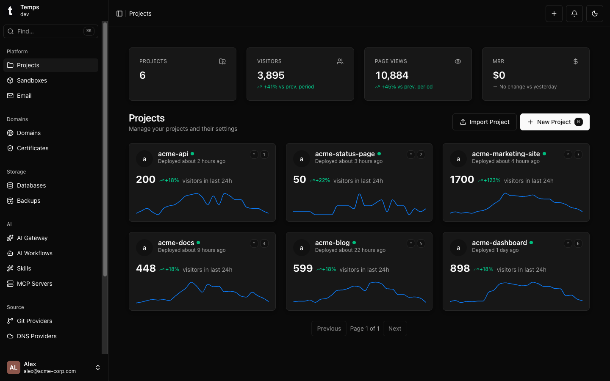
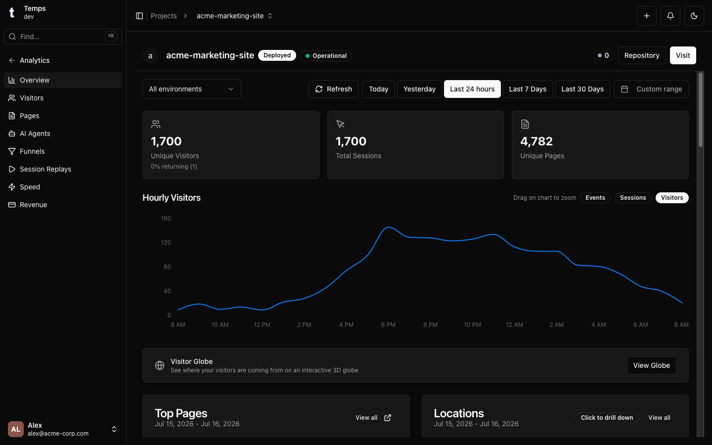
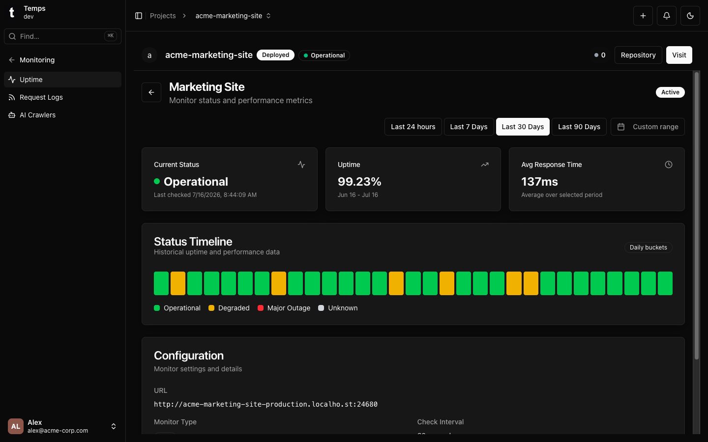
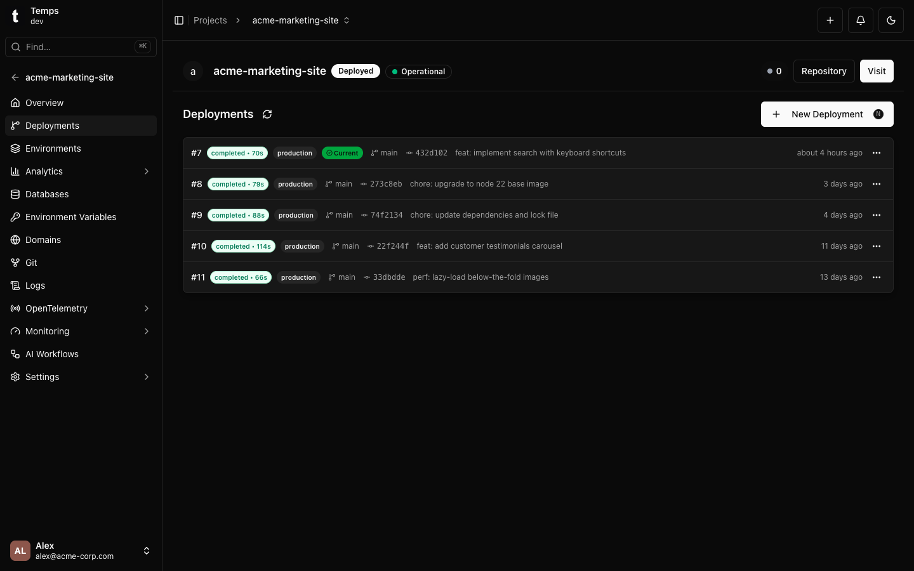
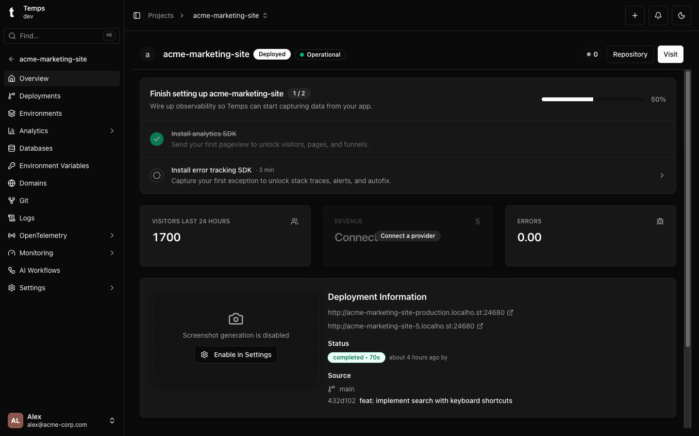
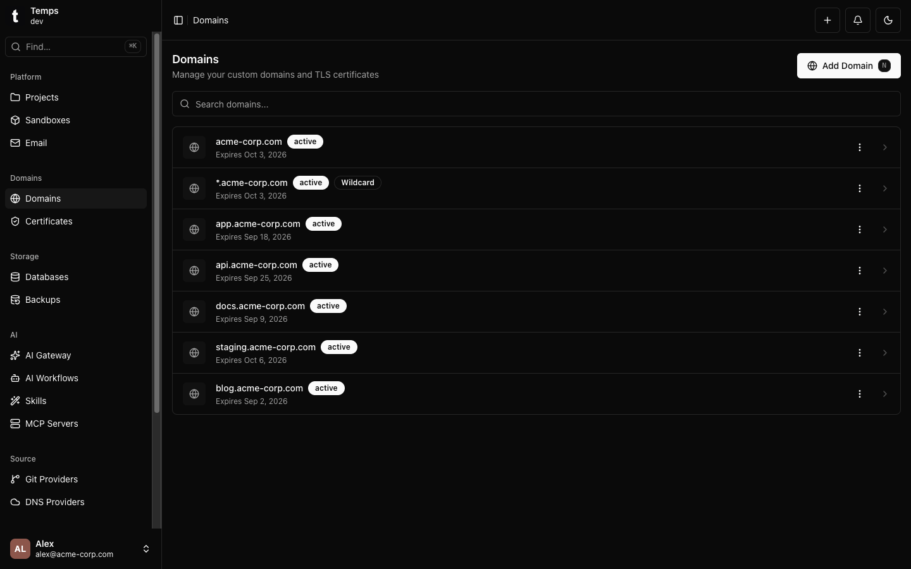
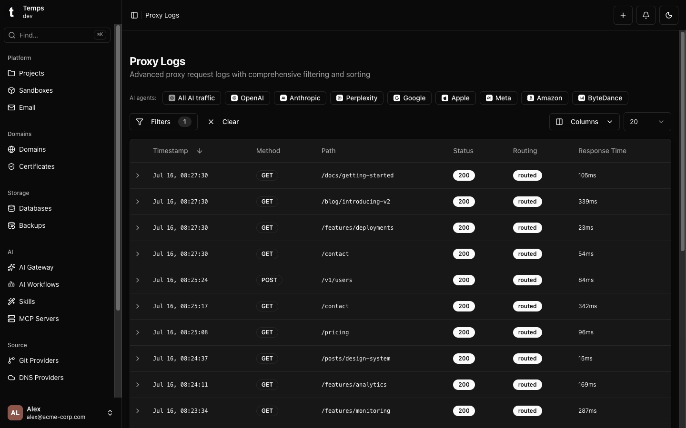

<div align="center">

<picture>
  <source media="(prefers-color-scheme: dark)" srcset="web/public/logo/temps-logo-dark.png">
  <source media="(prefers-color-scheme: light)" srcset="web/public/logo/temps-logo-light.png">
  
</picture>

### La plateforme de déploiement open source et auto-hébergée.
### Déployez, observez et scalez -- depuis un seul binaire.

[](LICENSE)
[](https://github.com/gotempsh/temps/releases)
[](https://www.rust-lang.org/)
[](https://github.com/gotempsh/temps)

[Site web](https://temps.sh) | [Documentation](https://temps.sh/docs) | [Démarrage rapide](https://temps.sh/docs/introduction) | [Discussions](https://github.com/gotempsh/temps/discussions)

[English](README.md) | [简体中文](README.zh-CN.md) | [Español](README.es.md) | Français | [Deutsch](README.de.md) | [日本語](README.ja.md) | [Português](README.pt-BR.md)

</div>

---

<p align="center">
  
  <br />
  <em>D'un serveur nu à une application entièrement déployée — en moins de 3 minutes (166 s).</em>
</p>

```bash
curl -fsSL https://temps.sh/deploy.sh | bash
```



Arrêtez de payer 6 outils SaaS différents. Temps remplace votre plateforme de déploiement, vos analytics, votre suivi d'erreurs, votre session replay, votre monitoring de disponibilité et vos emails transactionnels -- le tout auto-hébergé, le tout dans un seul binaire.

---

## Fonctionnalités

<table>
<tr>
<td width="50%">

**Analytics et session replay intégrés**
Analytics web avec funnels, suivi des visiteurs et session replay (rrweb). Suivi d'erreurs compatible Sentry. Aucun service externe — c'est ce qu'aucune autre PaaS auto-hébergée ne propose.



</td>
<td width="50%">

**Monitoring de disponibilité et alertes**
Moniteurs d'uptime avec chronologie des statuts, plus des alertes en cas d'échec de déploiement, de crash à l'exécution, d'expiration de certificat ou de problème de sauvegarde. Soyez prévenu avant que les problèmes n'atteignent vos utilisateurs.



</td>
</tr>
<tr>
<td width="50%">

**Git push, c'est déployé**
Poussez sur Git, Temps build et déploie. Détection automatique des frameworks, URLs de préversion et rollouts sans interruption de service.



</td>
<td width="50%">

**Tout dans un seul tableau de bord**
Visiteurs, erreurs, statut des déploiements et état du monitoring par projet — un seul endroit au lieu de six onglets de navigateur.



</td>
</tr>
<tr>
<td width="50%">

**Proxy propulsé par Pingora**
Fonctionne sur Pingora, le moteur de Cloudflare. TLS automatique via Let's Encrypt (HTTP-01 et DNS-01), domaines personnalisés et journalisation complète des requêtes.



</td>
<td width="50%">

**Logs de requêtes et visibilité du proxy**
Chaque requête HTTP est journalisée avec méthode, chemin, statut, temps de réponse et métadonnées de routage. Filtrez et recherchez sans outillage supplémentaire.



</td>
</tr>
<tr>
<td width="100%" colspan="2">

**Services managés et emails transactionnels**
Provisionnez Postgres, Redis, S3 (MinIO) et MongoDB aux côtés de vos applications — Temps gère la création, les sauvegardes et la suppression. Ajoutez des domaines d'envoi avec enregistrements DKIM depuis l'interface et envoyez des emails transactionnels via `@temps-sdk/node-sdk`. Aucun service externe nécessaire.

</td>
</tr>
</table>

### Compatible avec votre stack

<p align="center">
<a href="https://nextjs.org"></a>
<a href="https://vitejs.dev"></a>
<a href="https://go.dev"></a>
<a href="https://python.org"></a>
<a href="https://rust-lang.org"></a>
<a href="https://java.com"></a>
<a href="https://dotnet.microsoft.com"></a>
<a href="https://nestjs.com"></a>
<a href="https://docker.com"></a>
</p>

<p align="center"><em>N'importe quel langage, n'importe quel framework. Détection automatique ou apportez votre propre Dockerfile.</em></p>

---

## Démarrage rapide

```bash
curl -fsSL https://temps.sh/deploy.sh | bash
```

**Testé sur :** Ubuntu 24.04 / 22.04 &nbsp;|&nbsp; Fonctionne aussi sur macOS

Vous préférez ne pas gérer de serveur ? [Temps Cloud](https://temps.sh/pricing) fait tourner Temps pour vous sur une infrastructure managée.

---

## Ce que Temps remplace

| Ce que vous obtenez | Au lieu de payer |
|---|---|
| Déploiements Git + URLs de préversion | Vercel / Netlify / Railway (20 $+/mois) |
| Analytics web + funnels | PostHog / Plausible (0-450 $/mois) |
| Session replay | PostHog / FullStory (0-2000 $/mois) |
| Suivi d'erreurs | Sentry (26 $+/mois) |
| Monitoring de disponibilité | Better Uptime / Pingdom (20 $+/mois) |
| Postgres/Redis/S3 managés | AWS RDS / ElastiCache (50 $+/mois) |
| Emails transactionnels + DKIM | Resend / SendGrid (20-100 $/mois) |
| Logs de requêtes + proxy | Cloudflare (0-200 $/mois) |
| **Total avec Temps** | **0 $ (auto-hébergé)** |

---

## Temps face aux alternatives

| Fonctionnalité | Temps | Coolify | Dokploy | Kamal | Railway | Render | Vercel |
|---|:---:|:---:|:---:|:---:|:---:|:---:|:---:|
| Auto-hébergé et open source | Oui | Oui | Oui | Oui | Non | Non | Non |
| Installation en un seul binaire | Oui | Non | Non | Outil CLI | -- | -- | -- |
| Déploiement par git push | Oui | Oui | Oui | Non | Oui | Oui | Oui |
| Déploiements de préversion | Oui | Oui | Oui | Non | Oui | Oui | Oui |
| TLS automatique (HTTP-01 + DNS-01) | Oui | Oui | Oui | Oui | Oui | Oui | Oui |
| Support de Docker Compose | Non | Oui | Oui | Non | -- | -- | -- |
| Bibliothèque de templates en un clic | Non | 280+ | Oui | Non | Oui | Oui | Oui |
| Analytics web | Oui | Non | Non | Non | Non | Non | Option payante |
| Session replay | Oui | Non | Non | Non | Non | Non | Non |
| Suivi d'erreurs (compatible Sentry) | Oui | Non | Non | Non | Non | Non | Non |
| Monitoring de disponibilité | Oui | Non | Non | Non | Non | Non | Non |
| Emails transactionnels + DKIM | Oui | Non | Non | Non | Non | Non | Non |
| Postgres / Redis managés | Oui | Oui | Oui | Non | Oui | Oui | Add-ons partenaires |
| Stockage compatible S3 | Oui | Non | Non | Non | Non | Non | Blob (payant) |
| Multi-nœud / clustering | Oui | Oui | Swarm | Oui | Managé | Managé | Managé |
| Fonctions edge / réseau edge mondial | Non | Non | Non | Non | Non | Non | Oui |
| Facturation par siège | Non | Non | Non | Non | 20 $/utilisateur (Pro) | Par utilisateur | 20 $/siège (Pro) |

**Là où les alternatives gagnent.** Coolify et Dokploy offrent un support de Docker Compose de premier ordre et des bibliothèques de templates en un clic (280+ applications sur Coolify) que Temps n'a pas encore, et tous deux ont des communautés bien plus grandes — Coolify à lui seul dépasse les 56k étoiles GitHub, tandis que Temps est le projet le plus récent de cette liste. Kamal est le choix le plus simple si tout ce que vous voulez, ce sont des déploiements Docker sans interruption pilotés depuis une CLI. Vercel et les autres plateformes managées vous offrent un réseau edge mondial, des fonctions edge et une absorption des attaques DDoS qu'un simple VPS ne peut pas égaler — et elles gèrent l'infrastructure à votre place, ce qui est une vraie valeur ajoutée si vous ne voulez jamais avoir à penser à un serveur.

Comparatifs détaillés et régulièrement mis à jour : [temps.sh/compare](https://temps.sh/compare)

---

## Stack technique

- **Backend :** Rust, Axum, Sea-ORM, Pingora (le moteur de proxy de Cloudflare), Bollard (API Docker)
- **Frontend :** React 19, TypeScript, Tailwind CSS, shadcn/ui
- **Base de données :** PostgreSQL + TimescaleDB
- **Architecture :** 30+ crates en workspace, architecture de services en trois couches

---

## SDKs

| Package | Description |
|---|---|
| [`@temps-sdk/node-sdk`](https://www.npmjs.com/package/@temps-sdk/node-sdk) | Client de l'API plateforme + suivi d'erreurs compatible Sentry |
| [`@temps-sdk/react-analytics`](https://www.npmjs.com/package/@temps-sdk/react-analytics) | Analytics React, session replay, Web Vitals, suivi de l'engagement |
| [`@temps-sdk/kv`](https://www.npmjs.com/package/@temps-sdk/kv) | Store clé-valeur serverless |
| [`@temps-sdk/blob`](https://www.npmjs.com/package/@temps-sdk/blob) | Stockage de fichiers (compatible S3) |
| [`@temps-sdk/cli`](https://www.npmjs.com/package/@temps-sdk/cli) | Interface en ligne de commande |

<details>
<summary><strong>Exemples rapides</strong></summary>

**Analytics** -- enveloppez votre application React, tout le reste est automatique :

```tsx
import { TempsAnalyticsProvider } from '@temps-sdk/react-analytics';

export default function App({ children }) {
  return <TempsAnalyticsProvider>{children}</TempsAnalyticsProvider>;
}
```

**Suivi d'erreurs** -- compatible Sentry, remplacement direct :

```typescript
import { ErrorTracking } from '@temps-sdk/node-sdk';

ErrorTracking.init({ dsn: 'https://key@your-instance.temps.dev/1' });

try {
  riskyOperation();
} catch (error) {
  ErrorTracking.captureException(error);
}
```

**Store KV** -- API façon Redis, zéro configuration :

```typescript
import { kv } from '@temps-sdk/kv';

await kv.set('user:123', { name: 'Alice', plan: 'pro' }, { ex: 3600 });
const user = await kv.get('user:123');
```

**Stockage blob** -- uploadez et servez des fichiers :

```typescript
import { blob } from '@temps-sdk/blob';

const { url } = await blob.put('avatars/user-123.png', fileBuffer);
const files = await blob.list({ prefix: 'avatars/' });
```

</details>

---

## Communauté

- [GitHub Discussions](https://github.com/gotempsh/temps/discussions) — questions, idées et partage de projets
- [GitHub Issues](https://github.com/gotempsh/temps/issues) — rapports de bugs et demandes de fonctionnalités

Si Temps vous fait économiser un abonnement SaaS, [une étoile](https://github.com/gotempsh/temps) aide d'autres personnes à le découvrir.

---

## Historique des étoiles

<a href="https://www.star-history.com/#gotempsh/temps&Date">
  <picture>
    <source media="(prefers-color-scheme: dark)" srcset="https://api.star-history.com/svg?repos=gotempsh/temps&type=Date&theme=dark" />
    <source media="(prefers-color-scheme: light)" srcset="https://api.star-history.com/svg?repos=gotempsh/temps&type=Date" />
    
  </picture>
</a>

---

## Contribuer

Les contributions sont les bienvenues. Consultez [CONTRIBUTING.md](CONTRIBUTING.md) pour les recommandations.

```bash
git clone https://github.com/gotempsh/temps.git
cd temps
cargo build --release
```

---

## Licence

Sous double licence [MIT](LICENSE-MIT) ou [Apache 2.0](LICENSE).

---

<div align="center">

[temps.sh](https://temps.sh) | [Documentation](https://temps.sh/docs) | [GitHub](https://github.com/gotempsh/temps)

</div>
