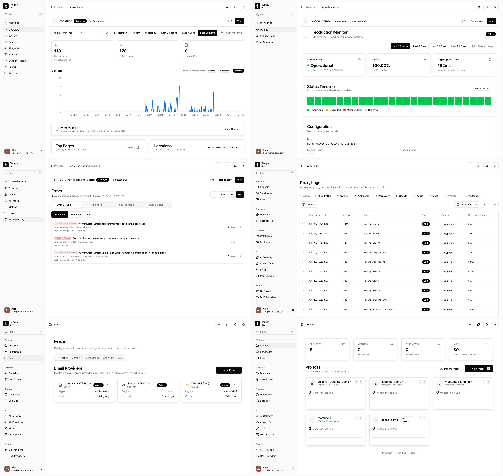

<div align="center">

<picture>
  <source media="(prefers-color-scheme: dark)" srcset="web/public/logo/temps-logo-dark.png">
  <source media="(prefers-color-scheme: light)" srcset="web/public/logo/temps-logo-light.png">
  
</picture>

**Vercel + Sentry + PostHog + Pingdom のオープンソース代替。**
デプロイ、アナリティクス、セッションリプレイ、エラートラッキング —— すべてをセルフホストの単一バイナリで。

[](LICENSE)
[](https://github.com/gotempsh/temps/releases)
[](https://www.rust-lang.org/)
[](https://github.com/gotempsh/temps)

[ウェブサイト](https://temps.sh) · [ドキュメント](https://temps.sh/docs) · [クイックスタート](https://temps.sh/docs/introduction) · [ディスカッション](https://github.com/gotempsh/temps/discussions) · [Contributing](CONTRIBUTING.md)

[English](README.md) | [简体中文](README.zh-CN.md) | [Español](README.es.md) | [Français](README.fr.md) | [Deutsch](README.de.md) | 日本語 | [Português](README.pt-BR.md)

</div>

---

```bash
curl -fsSL https://temps.sh/deploy.sh | bash
```

<picture>
  <source media="(prefers-color-scheme: dark)" srcset="assets/readme-hero-dark.png">
  
</picture>


6つもの SaaS ツールに料金を払うのはもうやめましょう。Temps はデプロイプラットフォーム、アナリティクス、エラートラッキング、セッションリプレイ、稼働監視、トランザクションメールをまとめて置き換えます —— すべてセルフホストで、すべて1つのバイナリに。

---

## 機能

<table>
<tr>
<td width="50%">

**アナリティクス & セッションリプレイを標準搭載**
ファネル分析、訪問者トラッキング、セッションリプレイ（rrweb）を備えたウェブアナリティクス。Sentry 互換のエラートラッキングも搭載。外部サービスは不要 —— これは他のセルフホスト型 PaaS にはない機能です。


</td>
<td width="50%">

**稼働監視 & アラート**
ステータスタイムライン付きの稼働モニターに加え、デプロイ失敗、ランタイムのクラッシュ、証明書の期限切れ、バックアップの健全性に対するアラートを提供。問題がユーザーに届く前に通知を受け取れます。


</td>
</tr>
<tr>
<td width="50%">

**Git プッシュでデプロイ**
Git にプッシュすれば、Temps がビルドしてデプロイします。フレームワークを自動検出し、プレビュー URL を作成し、ゼロダウンタイムのロールアウトを実行します。


</td>
<td width="50%">

**すべてを1つのダッシュボードに**
訪問者、エラー、デプロイ状況、監視の健全性をプロジェクトごとに一元表示 —— ブラウザのタブを6つ開く代わりに、この1画面で完結します。


</td>
</tr>
<tr>
<td width="50%">

**Pingora 駆動のプロキシ**
Cloudflare の Pingora エンジン上で動作。Let's Encrypt による自動 TLS（HTTP-01 & DNS-01）、カスタムドメイン、完全なリクエストロギングに対応。


</td>
<td width="50%">

**リクエストログ & プロキシの可視化**
すべての HTTP リクエストを、メソッド、パス、ステータス、レスポンスタイム、ルーティングメタデータとともに記録。追加ツールなしでフィルタリングと検索が可能です。


</td>
</tr>
<tr>
<td width="100%" colspan="2">

**マネージドサービス & トランザクションメール**
Postgres、Redis、S3（MinIO）、MongoDB をアプリと並べてプロビジョニング —— 作成、バックアップ、削除は Temps が処理します。UI から DKIM レコード付きの送信ドメインを追加し、`@temps-sdk/node-sdk` でトランザクションメールを送信できます。外部サービスは不要です。

</td>
</tr>
</table>

### あなたのスタックでそのまま使える

<p align="center">
<a href="https://nextjs.org"></a>
<a href="https://vitejs.dev"></a>
<a href="https://go.dev"></a>
<a href="https://python.org"></a>
<a href="https://rust-lang.org"></a>
<a href="https://java.com"></a>
<a href="https://dotnet.microsoft.com"></a>
<a href="https://nestjs.com"></a>
<a href="https://docker.com"></a>
</p>

<p align="center"><em>あらゆる言語、あらゆるフレームワークに対応。自動検出、または独自の Dockerfile を持ち込めます。</em></p>

---

## クイックスタート

```bash
curl -fsSL https://temps.sh/deploy.sh | bash
```

**動作確認済み:** Ubuntu 24.04 / 22.04 &nbsp;|&nbsp; macOS でも動作します

サーバーの管理はしたくない？ [Temps Cloud](https://temps.sh/pricing) なら、マネージドインフラ上で Temps をあなたの代わりに運用します。

---

## Temps が置き換えるもの

| 手に入るもの | 支払わずに済むもの |
|---|---|
| Git デプロイ + プレビュー URL | Vercel / Netlify / Railway（月額 $20〜） |
| ウェブアナリティクス + ファネル分析 | PostHog / Plausible（月額 $0〜450） |
| セッションリプレイ | PostHog / FullStory（月額 $0〜2000） |
| エラートラッキング | Sentry（月額 $26〜） |
| 稼働監視 | Better Uptime / Pingdom（月額 $20〜） |
| マネージド Postgres/Redis/S3 | AWS RDS / ElastiCache（月額 $50〜） |
| トランザクションメール + DKIM | Resend / SendGrid（月額 $20〜100） |
| リクエストログ + プロキシ | Cloudflare（月額 $0〜200） |
| **Temps での合計** | **$0（セルフホスト）** |

---

## Temps と代替ツールの比較

| 機能 | Temps | Coolify | Dokploy | Kamal | Railway | Render | Vercel |
|---|:---:|:---:|:---:|:---:|:---:|:---:|:---:|
| セルフホスト & オープンソース | あり | あり | あり | あり | なし | なし | なし |
| 単一バイナリでインストール | あり | なし | なし | CLI ツール | -- | -- | -- |
| Git プッシュでデプロイ | あり | あり | あり | なし | あり | あり | あり |
| プレビューデプロイ | あり | あり | あり | なし | あり | あり | あり |
| 自動 TLS（HTTP-01 + DNS-01） | あり | あり | あり | あり | あり | あり | あり |
| Docker Compose 対応 | なし | あり | あり | なし | -- | -- | -- |
| ワンクリックテンプレートライブラリ | なし | 280以上 | あり | なし | あり | あり | あり |
| ウェブアナリティクス | あり | なし | なし | なし | なし | なし | 有料アドオン |
| セッションリプレイ | あり | なし | なし | なし | なし | なし | なし |
| エラートラッキング（Sentry 互換） | あり | なし | なし | なし | なし | なし | なし |
| 稼働監視 | あり | なし | なし | なし | なし | なし | なし |
| トランザクションメール + DKIM | あり | なし | なし | なし | なし | なし | なし |
| マネージド Postgres / Redis | あり | あり | あり | なし | あり | あり | パートナーアドオン |
| S3 互換ストレージ | あり | なし | なし | なし | なし | なし | Blob（有料） |
| マルチノード / クラスタリング | あり | あり | Swarm | あり | マネージド | マネージド | マネージド |
| エッジ関数 / グローバルエッジネットワーク | なし | なし | なし | なし | なし | なし | あり |
| シートごとの課金 | なし | なし | なし | なし | $20/ユーザー（Pro） | ユーザー単位 | $20/シート（Pro） |

**代替ツールが勝る点。** Coolify と Dokploy には、Temps がまだ持っていない本格的な Docker Compose サポートとワンクリックテンプレートライブラリ（Coolify は280以上のアプリ）があり、コミュニティの規模もはるかに大きい —— Coolify だけで GitHub スター56k超を誇る一方、Temps はこのリストで最も新しいプロジェクトです。CLI からのゼロダウンタイム Docker デプロイだけが必要なら、Kamal のほうがシンプルな選択肢です。Vercel をはじめとするマネージドプラットフォームは、単一の VPS では太刀打ちできないグローバルエッジネットワーク、エッジ関数、DDoS 吸収能力を提供し、しかもインフラの運用まで代行してくれます —— サーバーのことを一切考えたくないなら、それは確かな価値です。

詳細で定期的に更新される比較はこちら: [temps.sh/compare](https://temps.sh/compare)

---

## 技術スタック

- **バックエンド:** Rust, Axum, Sea-ORM, Pingora（Cloudflare のプロキシエンジン）, Bollard（Docker API）
- **フロントエンド:** React 19, TypeScript, Tailwind CSS, shadcn/ui
- **データベース:** PostgreSQL + TimescaleDB
- **アーキテクチャ:** 30以上のワークスペースクレート、三層サービスアーキテクチャ

---

## SDK

| パッケージ | 説明 |
|---|---|
| [`@temps-sdk/node-sdk`](https://www.npmjs.com/package/@temps-sdk/node-sdk) | プラットフォーム API クライアント + Sentry 互換エラートラッキング |
| [`@temps-sdk/react-analytics`](https://www.npmjs.com/package/@temps-sdk/react-analytics) | React アナリティクス、セッションリプレイ、Web Vitals、エンゲージメント計測 |
| [`@temps-sdk/kv`](https://www.npmjs.com/package/@temps-sdk/kv) | サーバーレスのキーバリューストア |
| [`@temps-sdk/blob`](https://www.npmjs.com/package/@temps-sdk/blob) | ファイルストレージ（S3 互換） |
| [`@temps-sdk/cli`](https://www.npmjs.com/package/@temps-sdk/cli) | コマンドラインインターフェース |

<details>
<summary><strong>クイックサンプル</strong></summary>

**アナリティクス** —— React アプリをラップするだけで、あとはすべて自動:

```tsx
import { TempsAnalyticsProvider } from '@temps-sdk/react-analytics';

export default function App({ children }) {
  return <TempsAnalyticsProvider>{children}</TempsAnalyticsProvider>;
}
```

**エラートラッキング** —— Sentry 互換のドロップイン代替:

```typescript
import { ErrorTracking } from '@temps-sdk/node-sdk';

ErrorTracking.init({ dsn: 'https://key@your-instance.temps.dev/1' });

try {
  riskyOperation();
} catch (error) {
  ErrorTracking.captureException(error);
}
```

**KV ストア** —— Redis ライクな API、設定不要:

```typescript
import { kv } from '@temps-sdk/kv';

await kv.set('user:123', { name: 'Alice', plan: 'pro' }, { ex: 3600 });
const user = await kv.get('user:123');
```

**Blob ストレージ** —— ファイルのアップロードと配信:

```typescript
import { blob } from '@temps-sdk/blob';

const { url } = await blob.put('avatars/user-123.png', fileBuffer);
const files = await blob.list({ prefix: 'avatars/' });
```

</details>

---

## コミュニティ

- [GitHub Discussions](https://github.com/gotempsh/temps/discussions) — 質問、アイデア、成果の共有
- [GitHub Issues](https://github.com/gotempsh/temps/issues) — バグ報告と機能リクエスト

Temps のおかげで SaaS の請求が減ったなら、[スター](https://github.com/gotempsh/temps)を付けてもらえると、他の人が見つけやすくなります。

---

## スター履歴

<a href="https://www.star-history.com/#gotempsh/temps&Date">
  <picture>
    <source media="(prefers-color-scheme: dark)" srcset="https://api.star-history.com/svg?repos=gotempsh/temps&type=Date&theme=dark" />
    <source media="(prefers-color-scheme: light)" srcset="https://api.star-history.com/svg?repos=gotempsh/temps&type=Date" />
    
  </picture>
</a>

---

## コントリビューション

コントリビューションを歓迎します。ガイドラインは [CONTRIBUTING.md](CONTRIBUTING.md) をご覧ください。

```bash
git clone https://github.com/gotempsh/temps.git
cd temps
cargo build --release
```

---

## ライセンス

[MIT](LICENSE-MIT) または [Apache 2.0](LICENSE) のデュアルライセンスです。

---

<div align="center">

[temps.sh](https://temps.sh) | [ドキュメント](https://temps.sh/docs) | [GitHub](https://github.com/gotempsh/temps)

</div>
