<div align="center">

<picture>
  <source media="(prefers-color-scheme: dark)" srcset="assets/hero/stop-paying-dark.svg">
  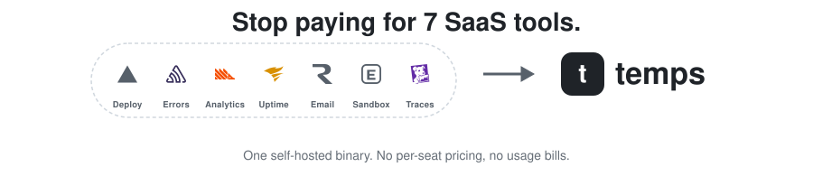
</picture>

[Website](https://temps.sh/?utm_source=github&utm_medium=repo&utm_content=header_en) · [Docs](https://temps.sh/docs?utm_source=github&utm_medium=repo&utm_content=header_en) · [Discussions](https://github.com/gotempsh/temps/discussions)

</div>

---

```bash
curl -fsSL https://temps.sh/deploy.sh | bash
```

<picture>
  <source media="(prefers-color-scheme: dark)" srcset="assets/screenshots/create-dark.png">
  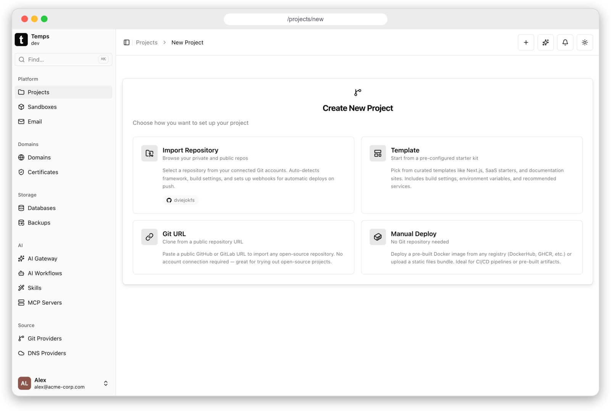
</picture>

---

## Features

### AI-native — 440+ operations any agent can drive

Every operation in the dashboard is also a CLI command — **440+ of them across 69 groups** — and Temps ships the [skills](skills/) that teach an agent how to use them. Drop them into **Claude Code**, **Codex**, **OpenCode**, or any harness that reads `.claude/skills/`, and your agent can deploy, inspect traces, run migrations, or add a domain without you writing the glue.

```bash
bunx @temps-sdk/cli projects list
bunx @temps-sdk/cli deploy my-app --environment production
bunx @temps-sdk/cli analytics ai-agents -p my-app --period 7d
```

Temps runs those agents for you too: workflow sandboxes execute Claude Code, Codex, or OpenCode against your repository, with platform-wide skills and MCP servers injected automatically.

### AI Chat — grounded in your own telemetry

Ask about your project and the answer comes from your data — traces, metrics, alarms, deployments, and revenue — not from a generic model guess. It is **read-only by default**: write actions are opt-in, and even then the assistant proposes the change and waits for you to confirm.

<picture>
  <source media="(prefers-color-scheme: dark)" srcset="assets/screenshots/ai-chat-dark.png">
  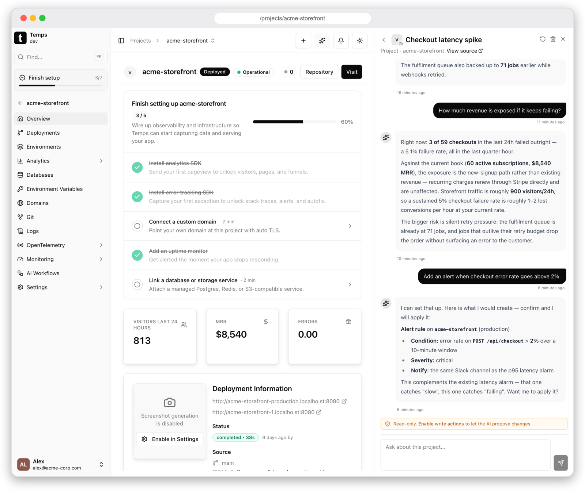
</picture>

### AI Gateway — one endpoint, your own keys

Bring your own provider keys (OpenAI, Anthropic, xAI, Google Gemini) and call them all through one OpenAI-compatible endpoint — swap the base URL, keep the SDK you already use. Keys stay encrypted on your server, and every request is attributed: tokens, latency, error rate, and estimated cost per model.

<picture>
  <source media="(prefers-color-scheme: dark)" srcset="assets/screenshots/ai-gateway-dark.png">
  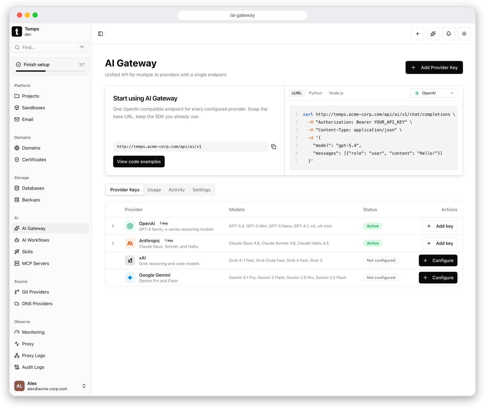
</picture>

<picture>
  <source media="(prefers-color-scheme: dark)" srcset="assets/screenshots/ai-usage-dark.png">
  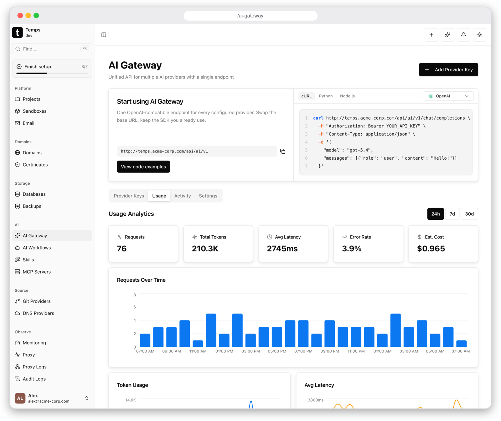
</picture>

### Web Analytics & Session Replay

Web analytics with funnels, visitor tracking, and session replay (rrweb) built in — no external services, no data leaving your servers. This is what no other self-hosted PaaS has.

<picture>
  <source media="(prefers-color-scheme: dark)" srcset="assets/screenshots/analytics-dark.png">
  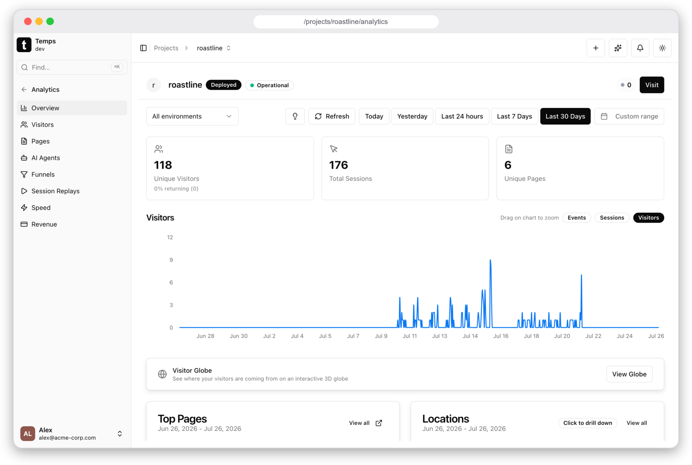
</picture>

### Uptime Monitoring & Alerts

Uptime monitors with status timelines, plus alerts for deploy failures, runtime crashes, certificate expiry, and backup health. Get notified before problems reach users.

<picture>
  <source media="(prefers-color-scheme: dark)" srcset="assets/screenshots/uptime-dark.png">
  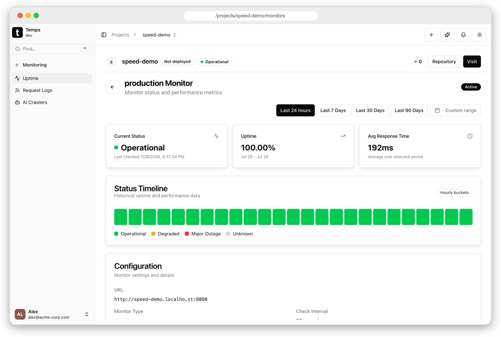
</picture>

### Error Tracking — Sentry-compatible

Drop-in Sentry replacement: point the official Sentry SDK at your Temps DSN and get error groups, stack traces with source context, and alerts. No per-event pricing.

<picture>
  <source media="(prefers-color-scheme: dark)" srcset="assets/screenshots/errors-dark.png">
  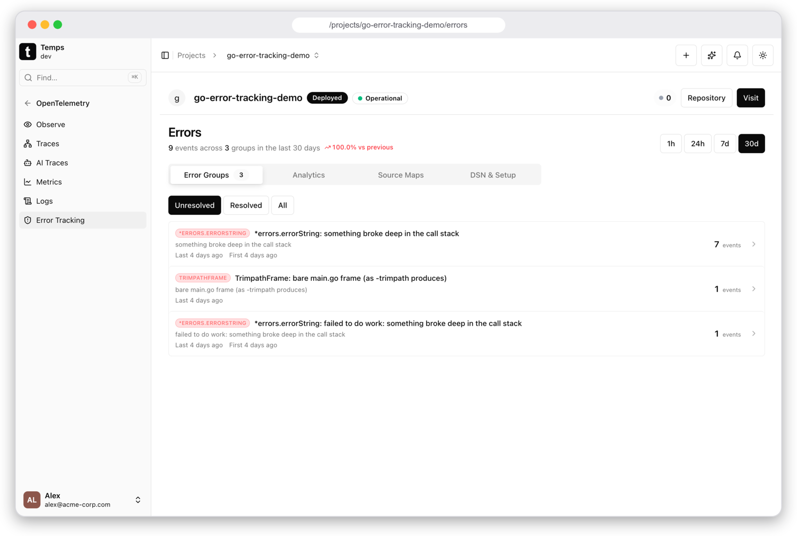
</picture>

### Request Logs & Proxy Visibility

Every HTTP request logged with method, path, status, response time, and routing metadata — including per-AI-crawler traffic (OpenAI, Anthropic, Perplexity, Google…). Runs on Cloudflare's Pingora engine with auto TLS via Let's Encrypt (HTTP-01 & DNS-01).

<picture>
  <source media="(prefers-color-scheme: dark)" srcset="assets/screenshots/request-logs-dark.png">
  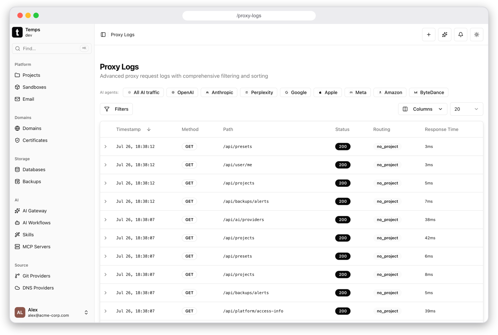
</picture>

### Transactional Email

Add sender domains with DKIM records through the UI and send via `@temps-sdk/node-sdk` — or plug in AWS SES, Scaleway, or any SMTP relay.

<picture>
  <source media="(prefers-color-scheme: dark)" srcset="assets/screenshots/email-dark.png">
  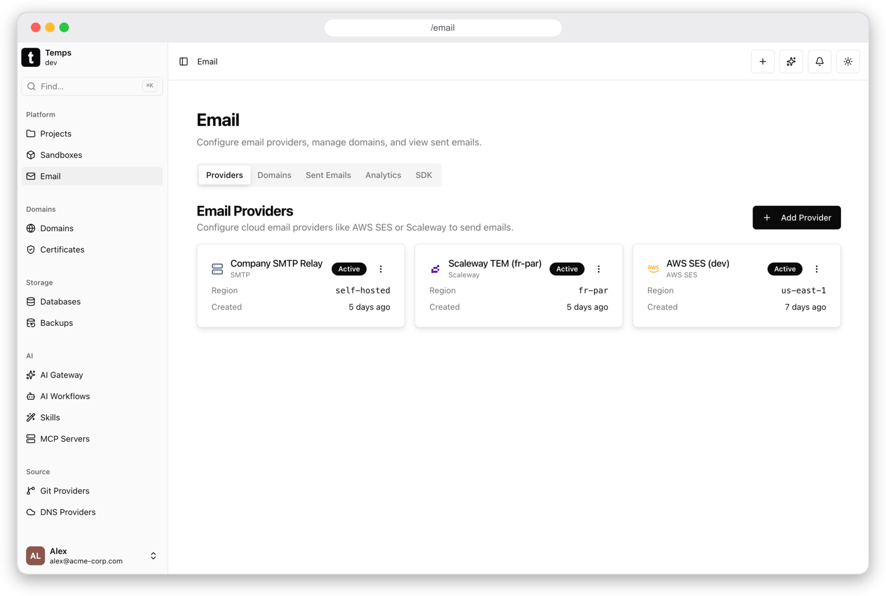
</picture>

### OpenTelemetry — traces, metrics, logs & alerts

Point any OTLP exporter at Temps and get distributed traces, metrics, and structured logs in the same place as everything else. Traces show per-span latency and errors across services; metrics keep your golden signals; alerts fire off those metrics and land in one queue you can acknowledge or resolve. No Grafana, Prometheus, Jaeger, or Loki to run.

<picture>
  <source media="(prefers-color-scheme: dark)" srcset="assets/screenshots/traces-dark.png">
  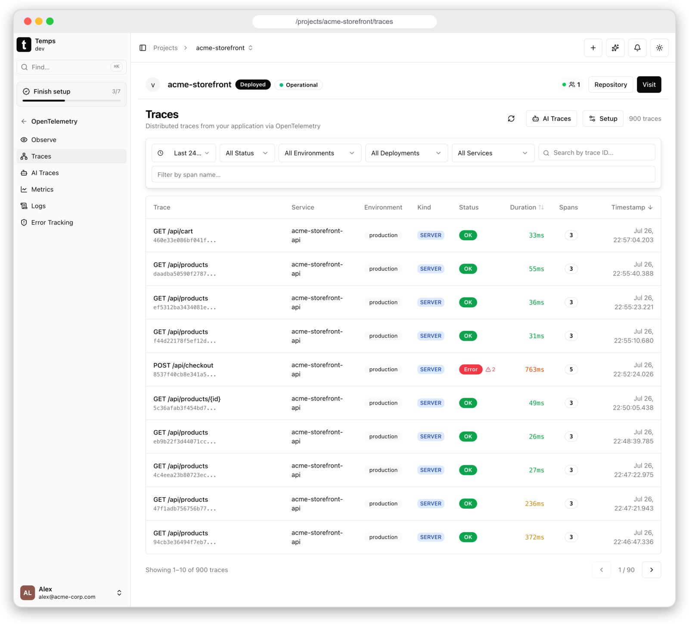
</picture>

<picture>
  <source media="(prefers-color-scheme: dark)" srcset="assets/screenshots/metrics-dark.png">
  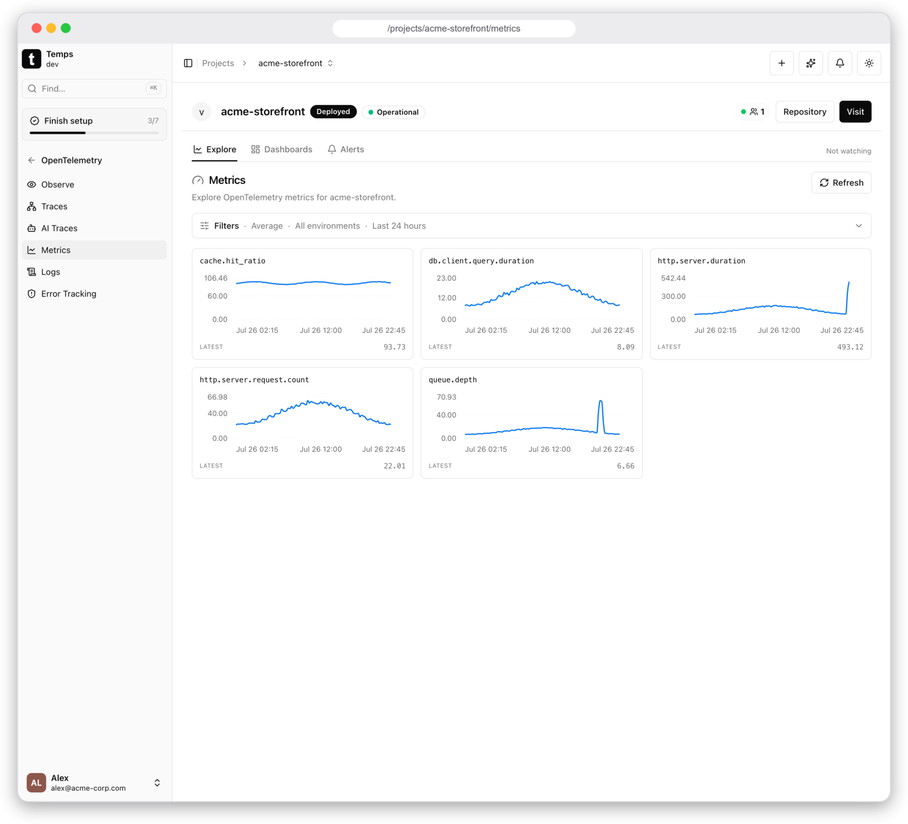
</picture>

<picture>
  <source media="(prefers-color-scheme: dark)" srcset="assets/screenshots/otel-logs-dark.png">
  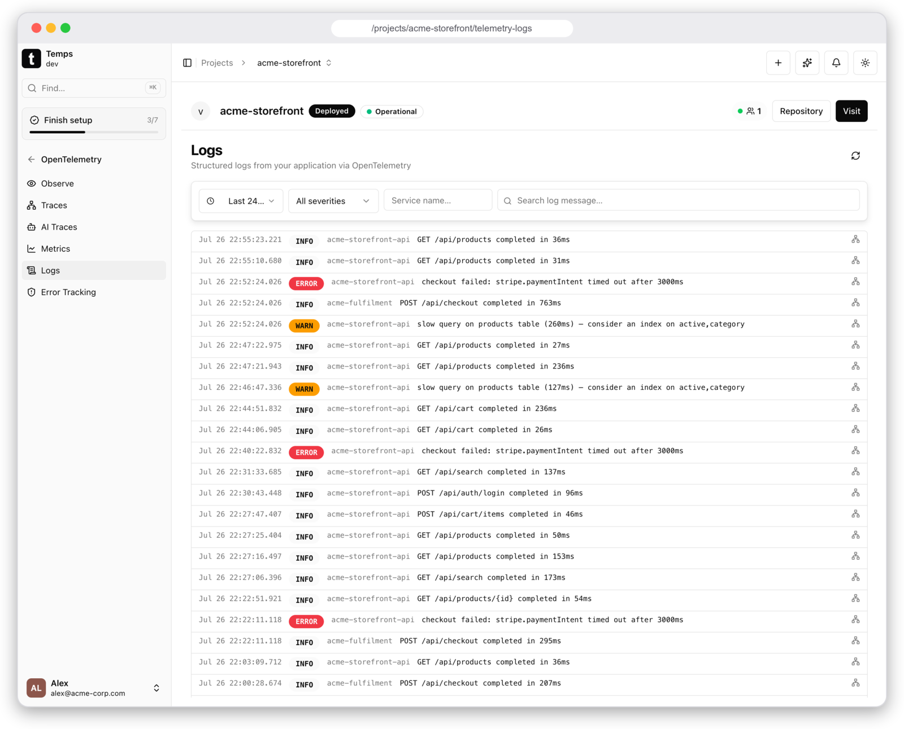
</picture>

<picture>
  <source media="(prefers-color-scheme: dark)" srcset="assets/screenshots/alerts-dark.png">
  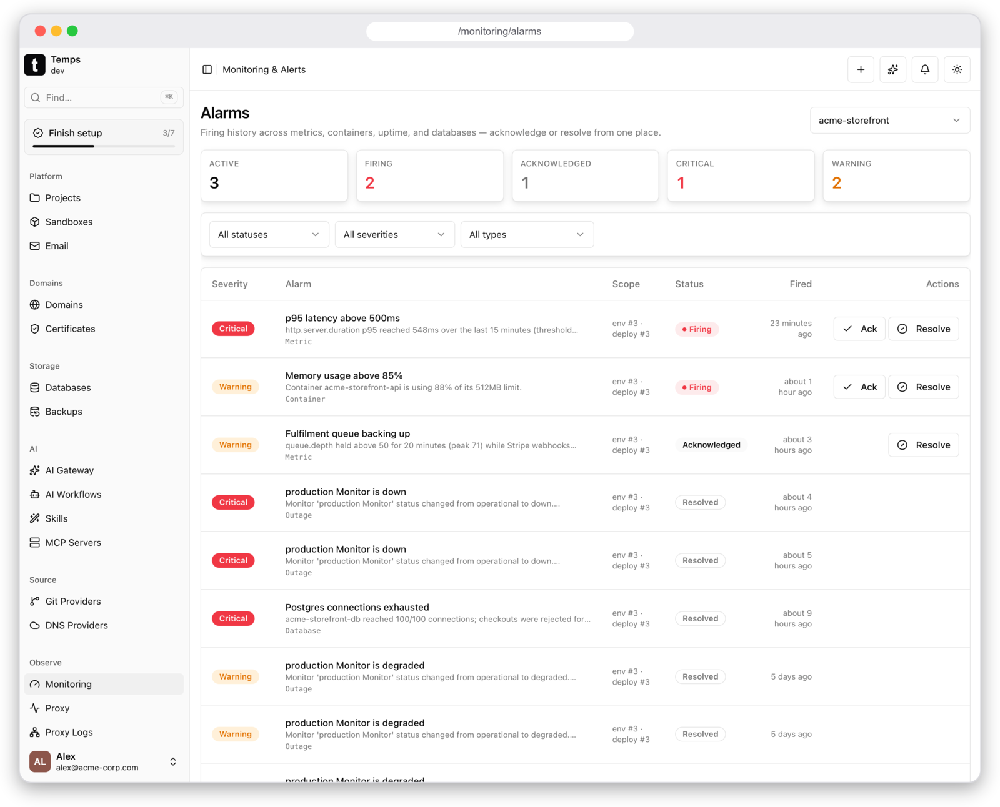
</picture>

### AI Sandboxes — Firecracker microVMs, self-hosted

**Real hardware-level isolation, not just containers.** Sandboxes run on **Firecracker microVMs** — the same tech behind AWS Lambda — with a **Docker** backend as the default. Run `temps firecracker setup` and Temps routes sandboxes to microVMs automatically; each one gets its own kernel, so untrusted agent-generated code never shares a kernel with your host.

**A drop-in SDK.** `@temps-sdk/sandbox` is compatible with the `@vercel/sandbox` shape — switch providers by changing the import and base URL:

```ts
import { Sandbox } from '@temps-sdk/sandbox'

const sandbox = await Sandbox.create({
  source: { type: 'git', url: 'https://github.com/example/repo.git', revision: 'main' },
})

const { stdout } = await sandbox.exec(['npm', 'test'])
const url = sandbox.domain(3000) // live preview of a dev server inside the VM
```

**Password-protected previews.** Every sandbox port can be exposed on a public preview URL and locked behind a generated password:

```bash
bunx @temps-sdk/cli sandbox password sbx_abc123 --rotate --length 32
bunx @temps-sdk/cli sandbox password sbx_abc123 --clear   # open it back up
```

Share a running branch without shipping it to the world.

Also available via CLI and REST API. What you'd otherwise pay E2B, Daytona, or Vercel Sandbox for.

<picture>
  <source media="(prefers-color-scheme: dark)" srcset="assets/screenshots/sandboxes-dark.png">
  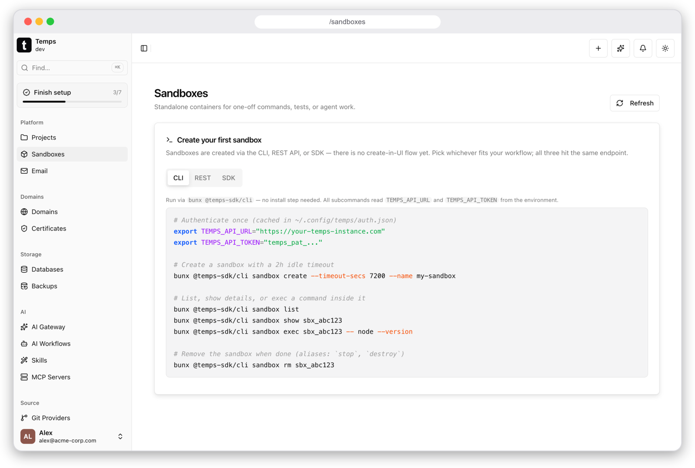
</picture>

Each sandbox gets a shell, a preview URL template for any port it binds, and a timeline of everything that happened to it:

<picture>
  <source media="(prefers-color-scheme: dark)" srcset="assets/screenshots/sandbox-detail-dark.png">
  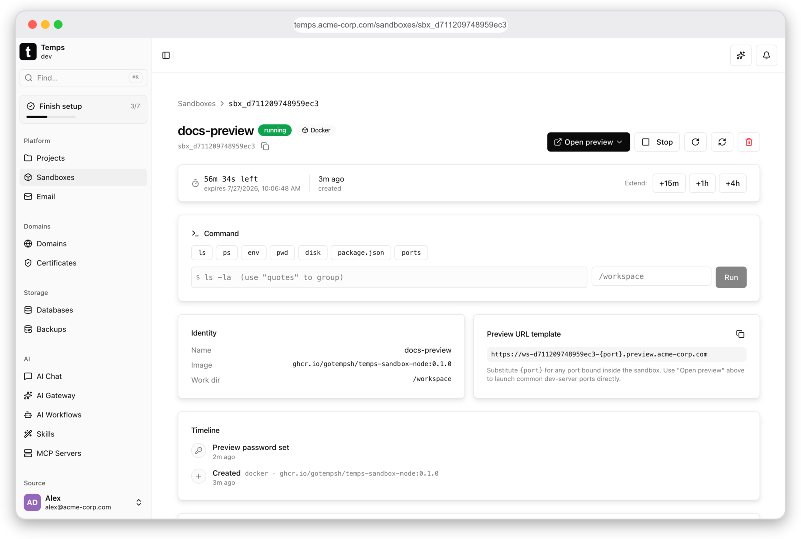
</picture>

### Everything in One Dashboard

Visitors, errors, deployment status, and monitoring health per project — one place instead of six browser tabs.

<picture>
  <source media="(prefers-color-scheme: dark)" srcset="assets/screenshots/dashboard-dark.png">
  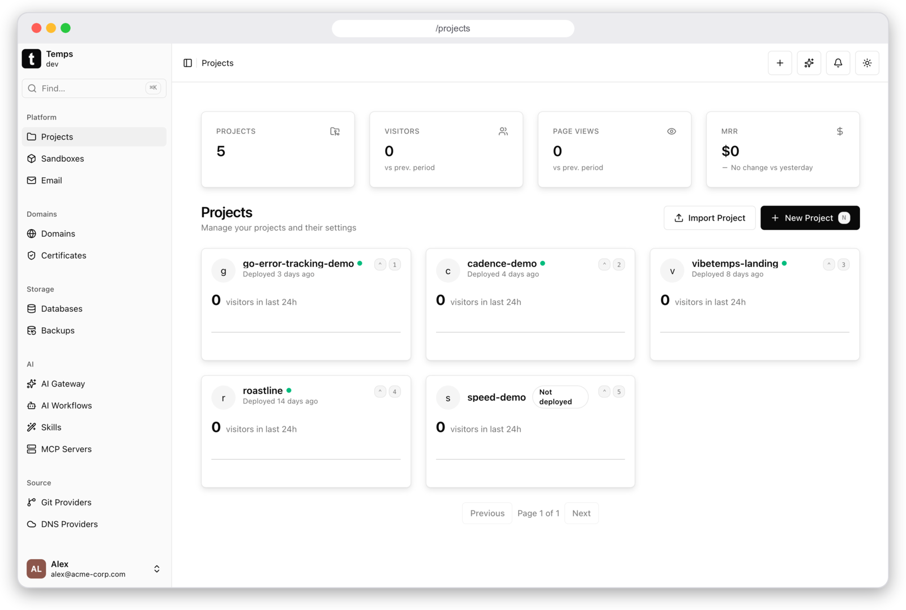
</picture>

### Git Push to Deploy & Managed Services

Push to Git and Temps builds, deploys, and creates preview URLs with zero-downtime rollouts — any language, auto-detected. Provision Postgres, Redis, S3 (MinIO), and MongoDB alongside your apps; creation, backups, and teardown are handled for you.

### Works with your stack

<p align="center">
<a href="https://nextjs.org"></a>
<a href="https://vitejs.dev"></a>
<a href="https://go.dev"></a>
<a href="https://python.org"></a>
<a href="https://rust-lang.org"></a>
<a href="https://java.com"></a>
<a href="https://dotnet.microsoft.com"></a>
<a href="https://nestjs.com"></a>
<a href="https://docker.com"></a>
</p>

<p align="center"><em>Any language, any framework. Auto-detected or bring your own Dockerfile.</em></p>

---

## Already running somewhere else?

Temps imports your existing setup instead of asking you to rebuild it. Point the wizard at your current platform and it brings over the whole thing — apps, databases *with their data*, domains, and environment variables.

**Self-hosted platforms**

<p align="center">
<a href="https://coolify.io"></a>
<a href="https://dokploy.com"></a>
<a href="https://caprover.com"></a>
<a href="https://portainer.io"></a>
<a href="https://kamal-deploy.org"></a>
<a href="https://kubernetes.io"></a>
<a href="https://docker.com"></a>
</p>

**Hosted platforms**

<p align="center">
<a href="https://vercel.com"></a>
<a href="https://netlify.com"></a>
<a href="https://railway.app"></a>
<a href="https://render.com"></a>
<a href="https://fly.io"></a>
</p>

<p align="center"><em>Import runs from the dashboard — the platform tiles sit right in your projects page header.</em></p>

---

## Quick Start

```bash
curl -fsSL https://temps.sh/deploy.sh | bash
```

**Tested on:** Ubuntu 24.04 / 22.04 &nbsp;|&nbsp; Also works on macOS

Prefer not to manage a server? [Temps Cloud](https://temps.sh/pricing?utm_source=github&utm_medium=repo&utm_content=cloud_cta_en) runs Temps for you on managed infrastructure.

---

## What Temps replaces

| What you get | Instead of paying for |
|---|---|
| Git deployments + preview URLs | Vercel / Netlify / Railway ($20+/mo) |
| Web analytics + funnels | PostHog / Plausible ($0-450/mo) |
| Session replay | PostHog / FullStory ($0-2000/mo) |
| Error tracking | Sentry ($26+/mo) |
| Traces, metrics & logs (OpenTelemetry) | Grafana Cloud / Datadog ($0-500+/mo) |
| Uptime monitoring | Better Uptime / Pingdom ($20+/mo) |
| Managed Postgres/Redis/S3 | AWS RDS / ElastiCache ($50+/mo) |
| Transactional email + DKIM | Resend / SendGrid ($20-100/mo) |
| AI code-execution sandboxes | E2B / Daytona / Vercel Sandbox ($150+/mo + usage) |
| AI gateway + usage/cost tracking | OpenRouter / Helicone / LangSmith ($0-200+/mo) |
| Request logs + proxy | Cloudflare ($0-200/mo) |
| **Total with Temps** | **$0 (self-hosted)** |

---

## Temps vs. Alternatives

| Feature | Temps | Coolify | Dokploy | Kamal | Railway | Render | Vercel |
|---|:---:|:---:|:---:|:---:|:---:|:---:|:---:|
| Self-hosted & open source | Yes | Yes | Yes | Yes | No | No | No |
| Single binary install | Yes | No | No | CLI tool | -- | -- | -- |
| Git push deploy | Yes | Yes | Yes | No | Yes | Yes | Yes |
| Preview deployments | Yes | Yes | Yes | No | Yes | Yes | Yes |
| Auto TLS (HTTP-01 + DNS-01) | Yes | Yes | Yes | Yes | Yes | Yes | Yes |
| Docker Compose support | Yes | Yes | Yes | No | -- | -- | -- |
| One-click template library | No | 280+ | Yes | No | Yes | Yes | Yes |
| Web analytics | Yes | No | No | No | No | No | Paid add-on |
| Session replay | Yes | No | No | No | No | No | No |
| Error tracking (Sentry-compatible) | Yes | No | No | No | No | No | No |
| OpenTelemetry traces + metrics + logs | Yes | No | No | No | No | No | Traces (paid) |
| Uptime monitoring | Yes | No | No | No | No | No | No |
| Transactional email + DKIM | Yes | No | No | No | No | No | No |
| Code-execution sandboxes (API) | Yes | No | No | No | No | No | Sandbox (usage-based) |
| AI gateway (BYOK) + assistant | Yes | No | No | No | No | No | AI Gateway (paid) |
| Managed Postgres / Redis | Yes | Yes | Yes | No | Yes | Yes | Partner add-ons |
| S3-compatible storage | Yes | No | No | No | No | No | Blob (paid) |
| Multi-node / clustering | Yes | Yes | Swarm | Yes | Managed | Managed | Managed |
| Edge functions / global edge network | No | No | No | No | No | No | Yes |
| Per-seat fees | No | No | No | No | $20/user (Pro) | Per-user | $20/seat (Pro) |

**Where the alternatives win.** Coolify and Dokploy have one-click template libraries (280+ apps on Coolify) that Temps doesn't have yet, and both have far larger communities — Coolify alone has 56k+ GitHub stars, while Temps is the newest project on this list. Kamal is the simpler choice if all you want is zero-downtime Docker deploys driven from a CLI. Vercel and the other managed platforms give you a global edge network, edge functions, and DDoS absorption that a single VPS can't match — and they run the infrastructure for you, which is real value if you never want to think about a server.

Detailed, regularly updated comparisons: [temps.sh/compare](https://temps.sh/compare?utm_source=github&utm_medium=repo&utm_content=compare_en)

---

## Tech Stack

- **Backend:** Rust, Axum, Sea-ORM, Pingora (Cloudflare's proxy engine), Bollard (Docker API)
- **Frontend:** React 19, TypeScript, Tailwind CSS, shadcn/ui
- **Database:** PostgreSQL + TimescaleDB
- **Architecture:** 30+ workspace crates, three-layer service architecture

---

## SDKs

| Package | Description |
|---|---|
| [`@temps-sdk/node-sdk`](https://www.npmjs.com/package/@temps-sdk/node-sdk) | Platform API client + Sentry-compatible error tracking |
| [`@temps-sdk/react-analytics`](https://www.npmjs.com/package/@temps-sdk/react-analytics) | React analytics, session replay, Web Vitals, engagement tracking |
| [`@temps-sdk/kv`](https://www.npmjs.com/package/@temps-sdk/kv) | Serverless key-value store |
| [`@temps-sdk/blob`](https://www.npmjs.com/package/@temps-sdk/blob) | File storage (S3-compatible) |
| [`@temps-sdk/cli`](https://www.npmjs.com/package/@temps-sdk/cli) | Command-line interface |

<details>
<summary><strong>Quick examples</strong></summary>

**Analytics** -- wrap your React app, everything else is automatic:

```tsx
import { TempsAnalyticsProvider } from '@temps-sdk/react-analytics';

export default function App({ children }) {
  return <TempsAnalyticsProvider>{children}</TempsAnalyticsProvider>;
}
```

**Error tracking** -- Sentry-compatible, drop-in replacement:

```typescript
import { ErrorTracking } from '@temps-sdk/node-sdk';

ErrorTracking.init({ dsn: 'https://key@your-instance.temps.dev/1' });

try {
  riskyOperation();
} catch (error) {
  ErrorTracking.captureException(error);
}
```

**KV store** -- Redis-like API, zero config:

```typescript
import { kv } from '@temps-sdk/kv';

await kv.set('user:123', { name: 'Alice', plan: 'pro' }, { ex: 3600 });
const user = await kv.get('user:123');
```

**Blob storage** -- upload and serve files:

```typescript
import { blob } from '@temps-sdk/blob';

const { url } = await blob.put('avatars/user-123.png', fileBuffer);
const files = await blob.list({ prefix: 'avatars/' });
```

</details>

---

## Community

- [GitHub Discussions](https://github.com/gotempsh/temps/discussions) — questions, ideas, and show & tell
- [GitHub Issues](https://github.com/gotempsh/temps/issues) — bug reports and feature requests

If Temps saves you a SaaS bill, [a star](https://github.com/gotempsh/temps) helps other people find it.

---

## Star History

<a href="https://www.star-history.com/#gotempsh/temps&Date">
  <picture>
    <source media="(prefers-color-scheme: dark)" srcset="https://api.star-history.com/svg?repos=gotempsh/temps&type=Date&theme=dark" />
    <source media="(prefers-color-scheme: light)" srcset="https://api.star-history.com/svg?repos=gotempsh/temps&type=Date" />
    
  </picture>
</a>

---

## Contributing

We welcome contributions. See [CONTRIBUTING.md](CONTRIBUTING.md) for guidelines.

```bash
git clone https://github.com/gotempsh/temps.git
cd temps
cargo build --release
```

---

## License

Dual-licensed under [MIT](LICENSE-MIT) or [Apache 2.0](LICENSE).

[](LICENSE)
[](https://github.com/gotempsh/temps/releases)
[](https://www.rust-lang.org/)
[](https://github.com/gotempsh/temps)

---

<div align="center">

[temps.sh](https://temps.sh/?utm_source=github&utm_medium=repo&utm_content=footer_en) | [Documentation](https://temps.sh/docs?utm_source=github&utm_medium=repo&utm_content=footer_en) | [GitHub](https://github.com/gotempsh/temps)

English | [简体中文](README.zh-CN.md) | [Español](README.es.md) | [Français](README.fr.md) | [Deutsch](README.de.md) | [日本語](README.ja.md) | [Português](README.pt-BR.md)

</div>
