# Pingora Load Balancer Configuration & Architecture

A comprehensive guide to understanding and configuring the Pingora reverse proxy in Temps.

## Table of Contents

1. [Overview](#overview)
2. [Pingora Integration](#pingora-integration)
3. [Request Processing](#request-processing)
4. [TLS/SSL Configuration](#tlsssl-configuration)
5. [Load Balancing](#load-balancing)
6. [Performance Tuning](#performance-tuning)
7. [Monitoring & Logging](#monitoring--logging)
8. [Security Hardening](#security-hardening)
9. [Troubleshooting](#troubleshooting)
10. [Advanced Configuration](#advanced-configuration)

---

## Overview

Pingora is Cloudflare's modern reverse proxy framework written in Rust. In Temps, it serves as the primary HTTP/HTTPS load balancer, handling:

- **HTTP/HTTPS routing** to deployed applications
- **TLS/SSL termination** with automatic certificate loading
- **Request/response filtering** (compression, headers, etc.)
- **Connection pooling** to upstream servers
- **Monitoring and analytics** event generation

### Pingora Benefits

```mermaid
graph TB
    subgraph "Pingora Advantages"
        A["🚀 High Performance<br/>Written in Rust, non-blocking I/O"]
        B["🔒 Modern TLS<br/>Rustls, OpenSSL, async cert loading"]
        C["⚙️ Extensible<br/>Request/response filters, upstream selection"]
        D["📊 Observable<br/>Prometheus metrics, detailed logging"]
        E["🛡️ Secure<br/>Memory safety, no GC pauses"]
    end

    style A fill:#c8e6c9
    style B fill:#c8e6c9
    style C fill:#c8e6c9
    style D fill:#c8e6c9
    style E fill:#c8e6c9
```



---

## Pingora Integration

### Architecture: Pingora + Temps


### Pingora ProxyHttp Implementation

The `LoadBalancer` struct in Temps implements Pingora's `ProxyHttp` trait:


### Server Setup

The Pingora server is initialized in `crates/temps-proxy/src/server.rs`:

```rust
pub async fn start_proxy(
    db: Arc<DbConnection>,
    config: ServerConfig,
) -> anyhow::Result<()> {
    // Create Pingora service with ProxyHttp implementation
    let mut my_server = http_proxy_service::<LoadBalancer>(
        LoadBalancer::new(
            upstream_resolver,
            request_logger,
            project_context_resolver,
            visitor_manager,
            session_manager,
            ip_access_control_service,
            challenge_service,
        ),
    );

    // Configure TLS with dynamic certificate loading
    my_server.add_tls_with_settings(
        ("0.0.0.0", 443),
        TlsSettings {
            tls_accept: Some(Box::new(DynamicCertLoader {
                cert_loader: Arc::new(CertificateLoader::new(db.clone())),
            })),
            ..
        },
    )?;

    // Configure HTTP listener
    my_server.add_http(("0.0.0.0", 80))?;

    // Start the server
    let mut my_server = my_server.build()?;
    my_server.run_forever().await?;

    Ok(())
}
```

---

## Request Processing

### Complete Request Lifecycle


### Phase Breakdown

#### Phase 1: Early (select_upstream)

```rust
#[async_trait]
impl ProxyHttp for LoadBalancer {
    async fn select_upstream(
        &self,
        session: &mut PingoraSession,
        _ctx: &mut PingoraContext,
    ) -> Result<Option<Upstream>, Box<Error>> {
        // 1. Extract domain from request
        let host = extract_host(&session)?;

        // 2. Resolve to project/environment/deployment
        let context = self.project_context_resolver
            .resolve_project_context(&host)
            .await?;

        // 3. Initialize request tracking
        let proxy_context = ProxyContext {
            project: Some(context.project.clone()),
            environment: Some(context.environment.clone()),
            deployment: Some(context.deployment.clone()),
            host: host.clone(),
            // ... initialize other fields
            ..Default::default()
        };

        // 4. Check IP access control
        if let Some(ip) = extract_client_ip(&session)? {
            let allowed = self.ip_access_control_service
                .is_ip_allowed(&context.project.id, &ip)
                .await?;

            if !allowed {
                return Err(Box::new(CustomError::IpBlocked));
            }
        }

        // 5. Check challenge
        if self.challenge_service
            .requires_challenge(&context.project.id)
            .await? {
            return Err(Box::new(CustomError::ChallengeRequired));
        }

        // 6. Resolve upstream (container IP)
        let upstream_peer = self.upstream_resolver
            .resolve_upstream(&context)
            .await?;

        Ok(Some(upstream_peer))
    }
}
```

#### Phase 2: Modify Request (request_filter)

```rust
async fn request_filter(
    &self,
    session: &mut PingoraSession,
    ctx: &mut ProxyContext,
) -> Result<()> {
    let req_header = session.req_header_mut();

    // 1. Add request tracking headers
    req_header.insert_header(
        "X-Request-ID",
        ctx.request_id.clone(),
    )?;

    req_header.insert_header(
        "X-Forwarded-For",
        ctx.ip_address.clone().unwrap_or_default(),
    )?;

    // 2. Add visitor/session IDs
    if let Some(visitor_id) = &ctx.visitor_id {
        req_header.insert_header("X-Visitor-ID", visitor_id)?;
    }

    // 3. Prepare compression
    if should_compress(&req_header) {
        ctx.response_compressed = true;
    }

    Ok(())
}
```

#### Phase 3: Proxy (upstream_peer)

```rust
async fn upstream_peer(
    &self,
    _session: &mut PingoraSession,
    ctx: &mut ProxyContext,
) -> Result<Box<Upstream>, Box<Error>> {
    // Return the upstream peer resolved in Phase 1
    // Pingora uses this to establish connection
    Ok(Box::new(selected_upstream))
}
```

#### Phase 4: Response (upstream_response_filter)

```rust
async fn upstream_response_filter(
    &self,
    session: &mut PingoraSession,
    ctx: &mut ProxyContext,
) -> Result<()> {
    let resp = session.resp_header_mut();

    // Store response metadata
    ctx.upstream_response_headers = Some(resp.clone());

    // Modify response headers
    resp.insert_header("X-Powered-By", "Temps")?;

    Ok(())
}
```

#### Phase 5: Response (response_filter)

```rust
async fn response_filter(
    &self,
    session: &mut PingoraSession,
    ctx: &mut ProxyContext,
) -> Result<()> {
    let resp = session.resp_header_mut();

    // Handle compression
    if ctx.response_compressed {
        resp.insert_header("Content-Encoding", "gzip")?;
    }

    // Set security headers
    resp.insert_header("X-Content-Type-Options", "nosniff")?;
    resp.insert_header("X-Frame-Options", "DENY")?;

    Ok(())
}
```

#### Phase 6: Logging (logging)

```rust
async fn logging(
    &self,
    session: &mut PingoraSession,
    ctx: &mut ProxyContext,
) {
    // Calculate metrics
    let duration_ms = ctx.start_time.elapsed().as_millis() as i32;
    let status = session.response_written().status();

    // Create analytics event
    let event = CreateProxyLogRequest {
        project_id: ctx.project.as_ref().map(|p| p.id),
        deployment_id: ctx.deployment.as_ref().map(|d| d.id),
        method: ctx.method.clone(),
        path: ctx.path.clone(),
        status: status as i32,
        duration_ms,
        ip_address: ctx.ip_address.clone(),
        user_agent: ctx.user_agent.clone(),
        visitor_id: ctx.visitor_id.clone(),
        session_id: ctx.session_id.clone(),
        // ... other fields
    };

    // Store in database
    if let Err(e) = self.proxy_log_service.create(event).await {
        error!("Failed to log request: {}", e);
    }
}
```

---

## TLS/SSL Configuration

### Dynamic Certificate Loading

Temps loads certificates dynamically based on SNI (Server Name Indication):


### Certificate Loader Implementation

```rust
pub struct CertificateLoader {
    db: Arc<DbConnection>,
    cache: Arc<DashMap<String, CertInfo>>,
}

impl CertificateLoader {
    pub async fn load_certificate(
        &self,
        sni: &str,
    ) -> Result<Option<(Vec<Vec<u8>>, PrivateKey)>> {
        // 1. Check cache first
        if let Some(cert_info) = self.cache.get(sni) {
            return Ok(Some((cert_info.certs.clone(), cert_info.key.clone())));
        }

        // 2. Query database for certificate
        let cert = Certificate::find()
            .filter(certificates::Column::Domain.eq(sni))
            .one(self.db.as_ref())
            .await?;

        if let Some(cert) = cert {
            let cert_info = CertInfo {
                certs: vec![cert.cert_pem.as_bytes().to_vec()],
                key: PrivateKey::from_pem(&cert.key_pem)?,
            };

            // 3. Update cache
            self.cache.insert(sni.to_string(), cert_info.clone());

            Ok(Some((cert_info.certs, cert_info.key)))
        } else {
            Ok(None)
        }
    }
}
```

### TLS Settings Configuration

```rust
let tls_settings = TlsSettings {
    // Use dynamic certificate loading
    tls_accept: Some(Box::new(DynamicCertLoader {
        cert_loader: Arc::new(CertificateLoader::new(db.clone())),
    })),

    // OpenSSL context options
    ssl_context: Some(create_ssl_context()?),

    // TLS version constraints (optional)
    min_tls_version: Some(TLSVersion::TLS12),
    max_tls_version: None,  // Use latest

    // Cipher configuration (optional)
    cipher_list: None,  // Use defaults

    // Session caching
    session_cache: SessionCacheConfig::enabled(),
};

my_server.add_tls_with_settings(
    ("0.0.0.0", 443),
    tls_settings,
)?;
```

---

## Load Balancing

### Upstream Selection


### HttpPeer Structure

```rust
pub struct HttpPeer {
    pub address: SocketAddr,      // IP:port of upstream
    pub ssl: bool,                // HTTPS or HTTP
    pub pool_id: PoolId,          // Connection pool ID
    pub sni: String,              // For upstream HTTPS
}

// Example
let peer = HttpPeer {
    address: "192.168.1.100:3000".parse()?,
    ssl: false,  // Docker container on private network
    pool_id: PoolId::new(),
    sni: "".to_string(),
};
```

### Load Balancing Strategies


---

## Performance Tuning

### Connection Pooling

Pingora maintains connection pools to upstream servers:

```mermaid
graph TB
    subgraph "Connection Pool"
        Pool["Pool for upstream<br/>192.168.1.100:3000"]
        Conn1["Connection 1<br/>(ready)"]
        Conn2["Connection 2<br/>(in-use)"]
        Conn3["Connection 3<br/>(ready)"]
    end

    subgraph "Reuse Benefits"
        B1["✓ Avoid TCP handshake"]
        B2["✓ Reduce latency"]
        B3["✓ Better throughput"]
    end

    Pool --> Conn1
    Pool --> Conn2
    Pool --> Conn3
    Conn1 --> B1
    Conn2 --> B2
    Conn3 --> B3

    style B1 fill:#c8e6c9
    style B2 fill:#c8e6c9
    style B3 fill:#c8e6c9
```



### Tuning Parameters

```bash
# Server configuration
temps serve \
  --address 0.0.0.0:8080 \
  --proxy-address 0.0.0.0:443 \
  --database-url postgresql://... \
  # Pingora accepts additional flags:
  # --workers 4 \              # Number of worker threads
  # --keepalive 60 \           # Upstream keep-alive seconds
  # --connect-timeout 5 \      # Connection timeout
  # --read-timeout 30          # Read timeout
```

### Memory Optimization


---

## Monitoring & Logging

### Prometheus Metrics

Pingora exposes Prometheus metrics:

```rust
// Metrics available via /metrics endpoint
pingora_upstream_request_total{upstream="..."} 1000
pingora_upstream_response_time_bucket{upstream="...",le="0.1"} 500
pingora_upstream_error_total{upstream="..."} 5
pingora_client_request_total{} 10000
pingora_client_response_time_bucket{le="1"} 9999
```

### Request Logging

```rust
// Each request logs:
// 1. Timestamp
// 2. Method + Path
// 3. Status code
// 4. Duration
// 5. Upstream address
// 6. Client IP

// Example from analytics database
{
  "request_id": "abc-123-def",
  "timestamp": "2024-01-15T10:30:45Z",
  "method": "GET",
  "path": "/api/users",
  "status": 200,
  "duration_ms": 45,
  "upstream_host": "192.168.1.100:3000",
  "client_ip": "203.0.113.45",
  "user_agent": "Mozilla/5.0...",
  "project_id": 1,
  "visitor_id": "v_abc123",
  "session_id": "s_xyz789"
}
```

### Debug Logging

Enable detailed logging:

```bash
# Set log level
RUST_LOG=debug temps serve ...

# Selective logging
RUST_LOG=temps_proxy=debug,pingora=info temps serve ...

# Log to file
RUST_LOG=debug temps serve ... 2>&1 | tee temps.log
```

---

## Security Hardening

### Security Headers

Pingora adds protective headers to responses:

```rust
// In response_filter()
resp.insert_header("X-Content-Type-Options", "nosniff")?;
resp.insert_header("X-Frame-Options", "DENY")?;
resp.insert_header("X-XSS-Protection", "1; mode=block")?;
resp.insert_header("Referrer-Policy", "strict-origin-when-cross-origin")?;
```

### Rate Limiting

Future enhancement to implement per-IP rate limiting:


### IP Access Control

```rust
// Check before proxying
if let Some(ip) = extract_client_ip(session)? {
    let allowed = ip_access_control_service
        .is_ip_allowed(&project_id, &ip)
        .await?;

    if !allowed {
        return Err(Box::new(CustomError::IpBlocked));
    }
}
```

### CAPTCHA Challenge

```rust
// Triggered for suspicious traffic
if challenge_service.requires_challenge(&project_id).await? {
    return serve_captcha_page(session)?;
}
```

---

## Troubleshooting

### Common Issues

#### Issue: Certificate Not Loading

```
Error: No certificate found for SNI: example.com
```

**Diagnosis**:
1. Check certificate exists in database: `SELECT * FROM certificates WHERE domain = 'example.com';`
2. Check certificate hasn't expired: `SELECT expires_at FROM certificates WHERE domain = 'example.com';`
3. Check certificate is valid PEM format

**Solution**:
```sql
-- Re-upload certificate
UPDATE certificates
SET cert_pem = '...'
WHERE domain = 'example.com';

-- Or add certificate
INSERT INTO certificates (domain, cert_pem, key_pem, expires_at)
VALUES ('example.com', '...', '...', ...);
```

#### Issue: Upstream Connection Failed

```
Error: Failed to connect to upstream
```

**Diagnosis**:
1. Check deployment is running: `docker ps | grep <container_id>`
2. Check container is accessible: `curl http://192.168.1.100:3000/`
3. Check firewall rules

**Solution**:
```bash
# Restart deployment
docker restart <container_id>

# Check container logs
docker logs <container_id>

# Test connectivity
curl -v http://<upstream_ip>:<port>/
```

#### Issue: High Latency

```
Response times > 1 second
```

**Diagnosis**:
1. Check upstream container: `docker stats <container_id>`
2. Check database: `EXPLAIN ANALYZE <query>;`
3. Check network: `ping <upstream_ip>`

**Solution**:
```bash
# Check Prometheus metrics
curl http://localhost:9090/metrics | grep upstream

# Review slow queries
SLOW_LOG SELECT * FROM mysql.slow_log ORDER BY start_time DESC;

# Optimize upstream app
# - Add caching
# - Optimize database queries
# - Scale horizontally
```

#### Issue: TLS Handshake Failures

```
Error: TLS alert: internal error
```

**Diagnosis**:
1. Check OpenSSL logs: `RUST_LOG=debug`
2. Check certificate chain
3. Check private key matches certificate

**Solution**:
```bash
# Verify certificate
openssl x509 -text -in cert.pem

# Verify private key
openssl rsa -check -in key.pem

# Verify match
openssl x509 -noout -modulus -in cert.pem | openssl md5
openssl rsa -noout -modulus -in key.pem | openssl md5
# Output should match
```

---

## Advanced Configuration

### Custom Request Filters

Extend request processing:

```rust
async fn request_filter(
    &self,
    session: &mut PingoraSession,
    ctx: &mut ProxyContext,
) -> Result<()> {
    let req_header = session.req_header_mut();

    // Custom: Block specific User-Agents
    if let Some(ua) = req_header.get_header_value("user-agent") {
        if ua.contains("bad-bot") {
            return Err(Box::new(CustomError::Forbidden));
        }
    }

    // Custom: Add rate limit headers
    req_header.insert_header("X-RateLimit-Limit", "1000")?;
    req_header.insert_header("X-RateLimit-Remaining", "999")?;

    Ok(())
}
```

### Custom Response Filters

Modify responses:

```rust
async fn response_filter(
    &self,
    session: &mut PingoraSession,
    ctx: &mut ProxyContext,
) -> Result<()> {
    let resp = session.resp_header_mut();

    // Custom: Serve stale content on error
    if is_error(resp.status) && has_stale_cache() {
        serve_cached_response(session)?;
    }

    // Custom: Add performance hints
    resp.insert_header("Link", "</static/app.js>; rel=preload; as=script")?;

    Ok(())
}
```

### Upstream Selection Strategy

Implement custom load balancing:

```rust
async fn select_upstream(
    &self,
    session: &mut PingoraSession,
    _ctx: &mut PingoraContext,
) -> Result<Option<Upstream>, Box<Error>> {
    let host = extract_host(&session)?;

    // Custom: Load balance across multiple containers
    let deployments = self.find_deployments(&host).await?;
    let selected = self.select_by_least_connections(&deployments)?;

    Ok(Some(selected))
}
```

---

## Conclusion

Pingora in Temps provides:

- **High-performance** HTTP/HTTPS load balancing
- **Flexible** request/response filtering
- **Dynamic** certificate loading
- **Comprehensive** logging and monitoring
- **Secure** by default with security headers

For more information:
- [Pingora GitHub](https://github.com/cloudflare/pingora)
- [Pingora Documentation](https://docs.rs/pingora/)
- [Temps Proxy Source](./crates/temps-proxy/)
