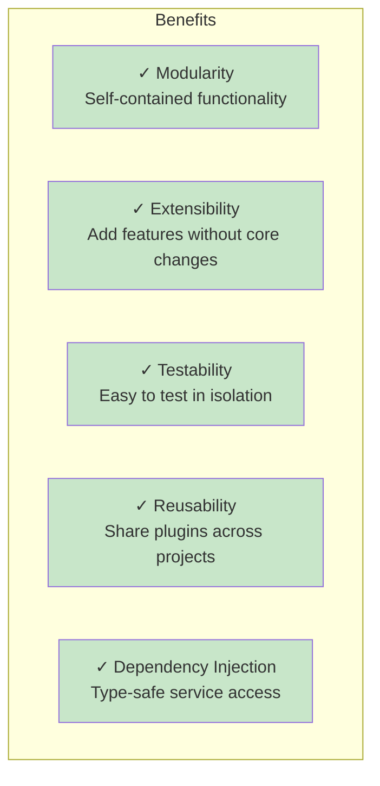
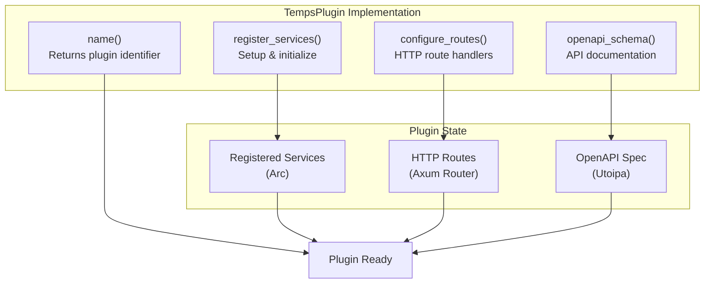
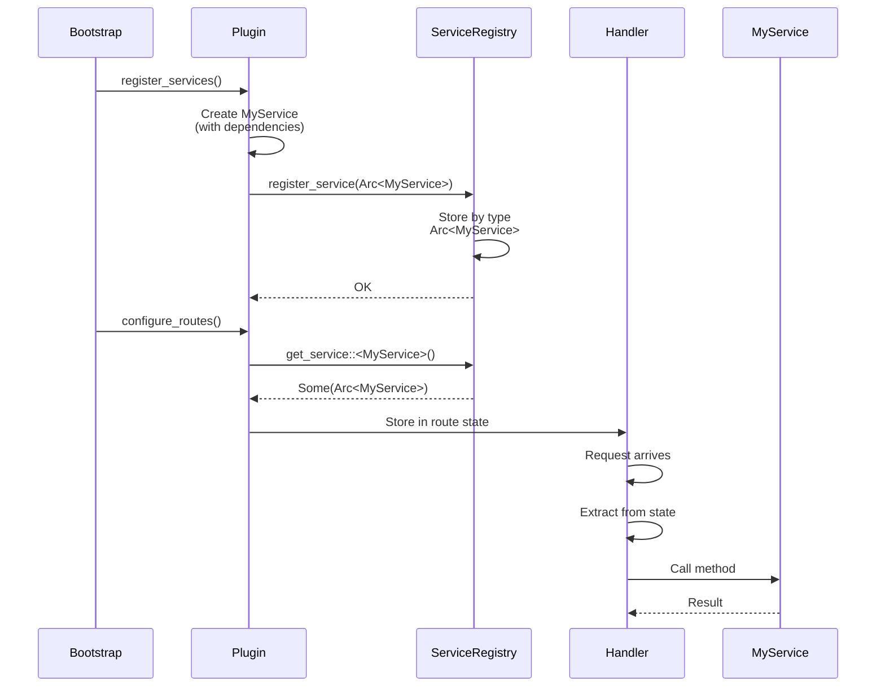
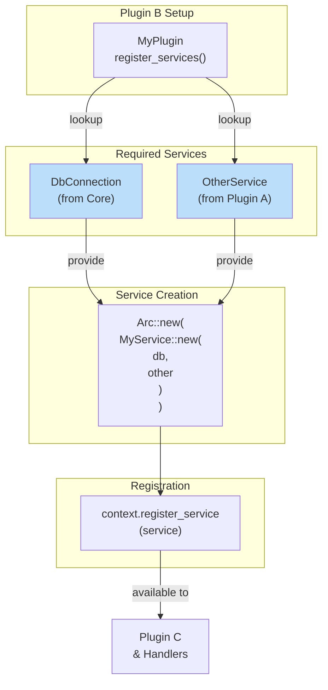
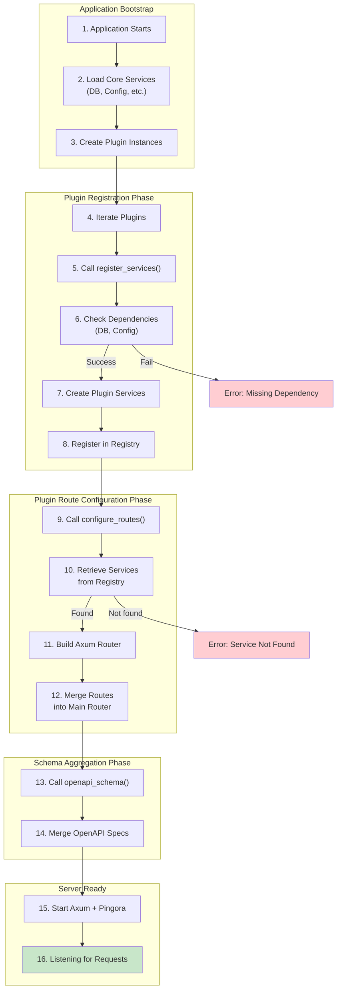
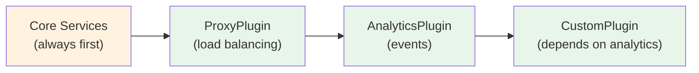
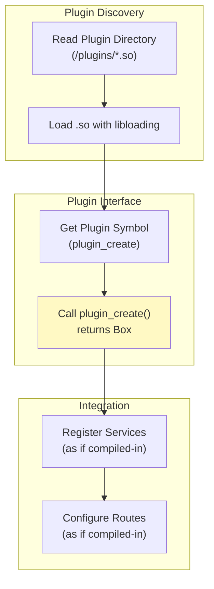

# Temps Plugin System Guide

A comprehensive guide to understanding and developing plugins for Temps.

## Table of Contents

1. [Overview](#overview)
2. [Plugin Architecture](#plugin-architecture)
3. [Creating a Plugin](#creating-a-plugin)
4. [Service Registration](#service-registration)
5. [Route Configuration](#route-configuration)
6. [OpenAPI Integration](#openapi-integration)
7. [Plugin Lifecycle](#plugin-lifecycle)
8. [Dynamic Loading (Future)](#dynamic-loading-future)
9. [Plugin Examples](#plugin-examples)
10. [Best Practices](#best-practices)
11. [Troubleshooting](#troubleshooting)

---

## Overview

The Temps Plugin System provides a modular, extensible architecture for adding functionality to the platform without modifying core code. Each plugin:

- Implements the `TempsPlugin` trait
- Registers services for dependency injection
- Configures HTTP routes
- Contributes to the OpenAPI schema

### Key Benefits



---

## Plugin Architecture

### The TempsPlugin Trait

All plugins implement this core trait:

```rust
pub trait TempsPlugin: Send + Sync {
    /// Plugin name (must be unique)
    fn name(&self) -> &'static str;

    /// Register services for other plugins to use
    async fn register_services(
        &self,
        context: &ServiceRegistrationContext,
    ) -> Result<(), PluginError>;

    /// Configure HTTP routes for this plugin
    fn configure_routes(&self, context: &PluginContext) -> Option<PluginRoutes>;

    /// Contribute to global OpenAPI schema
    fn openapi_schema(&self) -> Option<OpenApi>;
}
```

### Plugin Components



---

## Creating a Plugin

### Step 1: Create a New Crate

```bash
cargo new crates/my-plugin --lib
```

### Step 2: Add Dependency

Edit `crates/my-plugin/Cargo.toml`:

```toml
[package]
name = "my-plugin"
version = "0.1.0"
edition = "2021"

[dependencies]
async-trait = "0.1"
tokio = { workspace = true }
tracing = { workspace = true }
temps-core = { path = "../temps-core" }
temps-database = { path = "../temps-database" }
axum = { workspace = true }
utoipa = { workspace = true, features = ["axum_extras"] }
```

### Step 3: Implement the Plugin

Create `crates/my-plugin/src/lib.rs`:

```rust
use async_trait::async_trait;
use std::sync::Arc;
use temps_core::plugin::{
    PluginContext, PluginError, PluginRoutes, ServiceRegistrationContext, TempsPlugin,
};
use temps_database::DbConnection;
use utoipa::OpenApi;

// Your service implementation
pub struct MyService {
    db: Arc<DbConnection>,
}

impl MyService {
    pub fn new(db: Arc<DbConnection>) -> Self {
        Self { db }
    }

    pub async fn do_something(&self) -> Result<String, String> {
        // Your business logic here
        Ok("Success".to_string())
    }
}

// Plugin implementation
pub struct MyPlugin;

#[async_trait]
impl TempsPlugin for MyPlugin {
    fn name(&self) -> &'static str {
        "my-plugin"
    }

    async fn register_services(
        &self,
        context: &ServiceRegistrationContext,
    ) -> Result<(), PluginError> {
        // Get database connection
        let db = context.get_service::<DbConnection>()
            .ok_or_else(|| PluginError::ServiceNotFound {
                service_type: "DbConnection".to_string(),
            })?;

        // Create and register your service
        let service = Arc::new(MyService::new(db));
        context.register_service(service);

        tracing::info!("MyPlugin services registered");
        Ok(())
    }

    fn configure_routes(&self, context: &PluginContext) -> Option<PluginRoutes> {
        // Get your service from registry
        let service = context.get_service::<MyService>()?;

        // Create an Axum state
        let app_state = Arc::new(service.clone());

        // Configure routes
        let router = axum::Router::new()
            .route("/api/my-plugin/status", axum::routing::get(status_handler))
            .with_state(app_state);

        Some(PluginRoutes::new(router))
    }

    fn openapi_schema(&self) -> Option<OpenApi> {
        // Define your API documentation
        Some(MyApiDoc::openapi())
    }
}

// Handler function
async fn status_handler(
    axum::extract::State(service): axum::extract::State<Arc<MyService>>,
) -> String {
    "Service is running".to_string()
}

// OpenAPI documentation
#[derive(utoipa::OpenApi)]
#[openapi(
    paths(status_handler),
    components(schemas()),
    info(title = "My Plugin API", version = "1.0.0")
)]
pub struct MyApiDoc;

impl Default for MyPlugin {
    fn default() -> Self {
        Self
    }
}
```

### Step 4: Register the Plugin

Add to `crates/temps-cli/src/main.rs`:

```rust
use my_plugin::MyPlugin;

// In the bootstrap function
let plugins: Vec<Box<dyn TempsPlugin>> = vec![
    Box::new(ProxyPlugin::new()),
    Box::new(DeployerPlugin::new()),
    Box::new(DomainsPlugin::new()),
    Box::new(MyPlugin::default()),  // Add your plugin
    // ... other plugins
];
```

---

## Service Registration

### Service Registration Flow



### Type-Safe Service Lookup

The service registry uses Rust's type system for compile-time safety:

```rust
// During plugin initialization
let service = context.get_service::<MyService>();
// Type: Option<Arc<MyService>>

// Use the service
if let Some(svc) = service {
    let result = svc.do_something().await;
}
```

### Service Dependencies



---

## Route Configuration

### Creating Routes with Axum

```rust
use axum::{
    extract::{Path, State},
    http::StatusCode,
    routing::{get, post},
    Json, Router,
};

#[derive(serde::Deserialize)]
pub struct CreateRequest {
    pub name: String,
}

#[derive(serde::Serialize)]
pub struct ItemResponse {
    pub id: String,
    pub name: String,
}

async fn list_items(
    State(service): State<Arc<MyService>>,
) -> Json<Vec<ItemResponse>> {
    // Call service and return JSON
    Json(vec![])
}

async fn create_item(
    State(service): State<Arc<MyService>>,
    Json(req): Json<CreateRequest>,
) -> (StatusCode, Json<ItemResponse>) {
    // Create item via service
    (StatusCode::CREATED, Json(ItemResponse {
        id: "1".to_string(),
        name: req.name,
    }))
}

async fn get_item(
    State(service): State<Arc<MyService>>,
    Path(id): Path<String>,
) -> Result<Json<ItemResponse>, StatusCode> {
    // Get item from service
    Ok(Json(ItemResponse {
        id,
        name: "Item".to_string(),
    }))
}

// Configure routes in your plugin
fn configure_routes(&self, context: &PluginContext) -> Option<PluginRoutes> {
    let service = context.get_service::<MyService>()?;
    let app_state = Arc::new(service.clone());

    let router = Router::new()
        .route("/api/items", get(list_items).post(create_item))
        .route("/api/items/:id", get(get_item))
        .with_state(app_state);

    Some(PluginRoutes::new(router))
}
```

### Route Naming Convention

- **Admin APIs**: `/api/admin/*`
- **Plugin APIs**: `/api/<plugin-name>/*`
- **Public APIs**: `/api/public/*`
- **Internal APIs**: `/api/_temps/*` (Temps reserved)

### Error Handling

```rust
use axum::http::StatusCode;

#[derive(serde::Serialize)]
struct ErrorResponse {
    error: String,
    code: String,
}

async fn safe_handler(
    State(service): State<Arc<MyService>>,
) -> Result<Json<ItemResponse>, (StatusCode, Json<ErrorResponse>)> {
    service.do_something()
        .await
        .map(|item| Json(item))
        .map_err(|err| {
            (
                StatusCode::INTERNAL_SERVER_ERROR,
                Json(ErrorResponse {
                    error: err.to_string(),
                    code: "INTERNAL_ERROR".to_string(),
                }),
            )
        })
}
```

---

## OpenAPI Integration

### Documenting Your API

Use `utoipa` for automatic OpenAPI schema generation:

```rust
use utoipa::{OpenApi, path};

#[path(
    get,
    path = "/api/items",
    responses(
        (status = 200, description = "List of items", body = Vec<ItemResponse>),
        (status = 500, description = "Server error")
    )
)]
async fn list_items(
    State(service): State<Arc<MyService>>,
) -> Json<Vec<ItemResponse>> {
    Json(vec![])
}

#[path(
    post,
    path = "/api/items",
    request_body = CreateRequest,
    responses(
        (status = 201, description = "Item created", body = ItemResponse),
        (status = 400, description = "Invalid request")
    )
)]
async fn create_item(
    State(service): State<Arc<MyService>>,
    Json(req): Json<CreateRequest>,
) -> (StatusCode, Json<ItemResponse>) {
    // Implementation
    (StatusCode::CREATED, Json(ItemResponse {
        id: "1".to_string(),
        name: req.name,
    }))
}

#[derive(utoipa::OpenApi)]
#[openapi(
    paths(list_items, create_item),
    components(schemas(ItemResponse, CreateRequest)),
    info(title = "My Plugin API", version = "1.0.0")
)]
pub struct MyApiDoc;

// In plugin implementation
fn openapi_schema(&self) -> Option<OpenApi> {
    Some(MyApiDoc::openapi())
}
```

### Schema Merging

At startup, all plugin schemas are merged into one global schema:

```rust
// In core bootstrap
let mut merged_schema = MyApiDoc::openapi();

for plugin in &plugins {
    if let Some(schema) = plugin.openapi_schema() {
        merged_schema = temps_core::openapi::merge_openapi_schemas(
            merged_schema,
            vec![schema],
        );
    }
}
```

---

## Plugin Lifecycle

### Complete Lifecycle Diagram



### Plugin Load Order

Plugins are loaded in the order they're registered. Dependencies should be managed carefully:



---

## Dynamic Loading (Future)

While Temps currently uses compile-time plugin registration, the architecture is designed for future support of dynamic .so loading.

### Future .so Plugin Loading



### Example .so Plugin Structure

```rust
// In plugin crate with cdylib output
#[no_mangle]
pub extern "C" fn plugin_create() -> *mut dyn TempsPlugin {
    let plugin = Box::new(MyPlugin::default());
    Box::into_raw(plugin)
}

#[no_mangle]
pub extern "C" fn plugin_destroy(plugin: *mut dyn TempsPlugin) {
    if !plugin.is_null() {
        unsafe {
            Box::from_raw(plugin);
        }
    }
}
```

### How It Would Work

```toml
# Plugin crate
[lib]
crate-type = ["cdylib"]

# Build with: cargo build --release --target x86_64-unknown-linux-gnu
# Output: target/release/libmy_plugin.so
```

Then Temps could load at runtime:

```rust
use libloading::{Library, Symbol};

let lib = Library::new("/plugins/libmy_plugin.so")?;
let create: Symbol<extern "C" fn() -> *mut dyn TempsPlugin> =
    unsafe { lib.get(b"plugin_create")? };
let plugin = unsafe { Box::from_raw(create()) };
```

---

## Plugin Examples

### Example 1: Simple Metrics Plugin

```rust
use async_trait::async_trait;
use std::sync::Arc;
use std::sync::atomic::{AtomicU64, Ordering};
use temps_core::plugin::{
    PluginContext, PluginError, PluginRoutes, ServiceRegistrationContext, TempsPlugin,
};
use utoipa::OpenApi;

pub struct MetricsService {
    request_count: Arc<AtomicU64>,
}

impl MetricsService {
    pub fn new() -> Self {
        Self {
            request_count: Arc::new(AtomicU64::new(0)),
        }
    }

    pub fn increment_requests(&self) {
        self.request_count.fetch_add(1, Ordering::Relaxed);
    }

    pub fn get_count(&self) -> u64 {
        self.request_count.load(Ordering::Relaxed)
    }
}

pub struct MetricsPlugin;

#[async_trait]
impl TempsPlugin for MetricsPlugin {
    fn name(&self) -> &'static str {
        "metrics"
    }

    async fn register_services(
        &self,
        context: &ServiceRegistrationContext,
    ) -> Result<(), PluginError> {
        let service = Arc::new(MetricsService::new());
        context.register_service(service);
        Ok(())
    }

    fn configure_routes(&self, context: &PluginContext) -> Option<PluginRoutes> {
        let service = context.get_service::<MetricsService>()?;
        let router = axum::Router::new()
            .route(
                "/api/metrics",
                axum::routing::get(|| async move {
                    axum::Json(serde_json::json!({
                        "requests": service.get_count()
                    }))
                }),
            )
            .with_state(Arc::new(service.clone()));

        Some(PluginRoutes::new(router))
    }

    fn openapi_schema(&self) -> Option<OpenApi> {
        None
    }
}

impl Default for MetricsPlugin {
    fn default() -> Self {
        Self
    }
}
```

### Example 2: Database Plugin

```rust
use async_trait::async_trait;
use std::sync::Arc;
use temps_database::DbConnection;
use temps_core::plugin::{
    PluginContext, PluginError, PluginRoutes, ServiceRegistrationContext, TempsPlugin,
};

pub struct DatabasePlugin;

#[async_trait]
impl TempsPlugin for DatabasePlugin {
    fn name(&self) -> &'static str {
        "database"
    }

    async fn register_services(
        &self,
        context: &ServiceRegistrationContext,
    ) -> Result<(), PluginError> {
        // Database is already registered by core
        let _db = context.get_service::<DbConnection>()
            .ok_or_else(|| PluginError::ServiceNotFound {
                service_type: "DbConnection".to_string(),
            })?;

        // Verify database is accessible
        tracing::info!("Database plugin verified");
        Ok(())
    }

    fn configure_routes(&self, context: &PluginContext) -> Option<PluginRoutes> {
        let _db = context.get_service::<DbConnection>()?;

        // Create health check endpoint
        let router = axum::Router::new()
            .route(
                "/api/health/db",
                axum::routing::get(|| async { "OK" }),
            );

        Some(PluginRoutes::new(router))
    }

    fn openapi_schema(&self) -> Option<OpenApi> {
        None
    }
}

impl Default for DatabasePlugin {
    fn default() -> Self {
        Self
    }
}
```

---

## Best Practices

### 1. Service Isolation

Keep services focused on a single responsibility:

```rust
// ❌ Bad: Do too much
impl MyService {
    async fn process(&self) -> Result<()> {
        // Database queries
        // Authentication
        // Authorization
        // Validation
        // Business logic
        // Notification
    }
}

// ✅ Good: Single responsibility
pub struct AuthService { /* ... */ }
pub struct ValidationService { /* ... */ }
pub struct BusinessService { /* ... */ }
pub struct NotificationService { /* ... */ }
```

### 2. Error Handling

Use proper error types:

```rust
use thiserror::Error;

#[derive(Error, Debug)]
pub enum MyPluginError {
    #[error("Database error: {0}")]
    Database(String),

    #[error("Validation error: {0}")]
    Validation(String),

    #[error("Service not found: {0}")]
    ServiceNotFound(String),
}

// In handlers, convert to HTTP responses
impl IntoResponse for MyPluginError {
    fn into_response(self) -> Response {
        let status = match self {
            Self::Database(_) => StatusCode::INTERNAL_SERVER_ERROR,
            Self::Validation(_) => StatusCode::BAD_REQUEST,
            Self::ServiceNotFound(_) => StatusCode::NOT_FOUND,
        };

        (status, self.to_string()).into_response()
    }
}
```

### 3. Testing Plugins

```rust
#[cfg(test)]
mod tests {
    use super::*;
    use temps_core::plugin::PluginStateRegistry;

    #[test]
    fn test_plugin_name() {
        let plugin = MyPlugin::default();
        assert_eq!(plugin.name(), "my-plugin");
    }

    #[tokio::test]
    async fn test_service_registration() {
        let context = ServiceRegistrationContext::new();

        // Mock database if needed
        // context.register_service(...);

        let plugin = MyPlugin::default();
        let result = plugin.register_services(&context).await;

        assert!(result.is_ok());
    }
}
```

### 4. Documentation

Document your plugin thoroughly:

```rust
/// MyPlugin provides custom business logic for Temps.
///
/// ## Features
/// - Feature 1
/// - Feature 2
///
/// ## Configuration
/// - `MY_PLUGIN_VAR`: Environment variable
///
/// ## API Endpoints
/// - `GET /api/my-plugin/status`: Check status
/// - `POST /api/my-plugin/action`: Perform action
pub struct MyPlugin;
```

### 5. Versioning

Keep track of your plugin version:

```rust
const PLUGIN_VERSION: &str = env!("CARGO_PKG_VERSION");

impl TempsPlugin for MyPlugin {
    fn name(&self) -> &'static str {
        "my-plugin"
    }

    fn version(&self) -> &'static str {
        PLUGIN_VERSION
    }
}
```

---

## Troubleshooting

### Common Issues

#### Issue: Service Not Found Error

```
Error: ServiceNotFound { service_type: "DbConnection" }
```

**Solution**: Ensure the service is registered before your plugin tries to use it. Check the load order in bootstrap.

#### Issue: Routes Not Showing in OpenAPI

```
Plugin routes are working but not in Swagger UI
```

**Solution**: Make sure you're returning `Some(schema)` from `openapi_schema()` and that it's being merged correctly.

#### Issue: Async Runtime Error

```
Error: Cannot block on async code
```

**Solution**: Use `#[tokio::main]` or ensure you're in an async context. Use `.await` for async calls.

#### Issue: Type Mismatch in Service Lookup

```
Error: type mismatch: expected `Arc<ServiceType>`, found `Arc<OtherType>`
```

**Solution**: Ensure service is registered with correct type. Generic trait objects require type matching.

### Debugging Tips

1. **Enable debug logging**: `RUST_LOG=debug`
2. **Check plugin load order**: Verify plugins are loaded in correct order
3. **Inspect service registry**: Add debug prints in `register_services()`
4. **Test routes in isolation**: Use curl to test endpoints directly
5. **Check OpenAPI schema**: Visit `/swagger-ui/` to verify routes are documented

### Performance Considerations

- Use `Arc<T>` for shared state instead of cloning
- Keep service initialization lightweight
- Use async/await for I/O operations
- Avoid blocking operations in handlers
- Use proper connection pooling for databases

---

## Next Steps

1. **Start small**: Create a simple metrics plugin first
2. **Add tests**: Write unit and integration tests
3. **Document API**: Use utoipa for OpenAPI documentation
4. **Contribute**: Consider contributing your plugin to the community
5. **Monitor**: Add logging and monitoring to your plugin

For more examples, check out the existing plugins in `crates/temps-*`.
