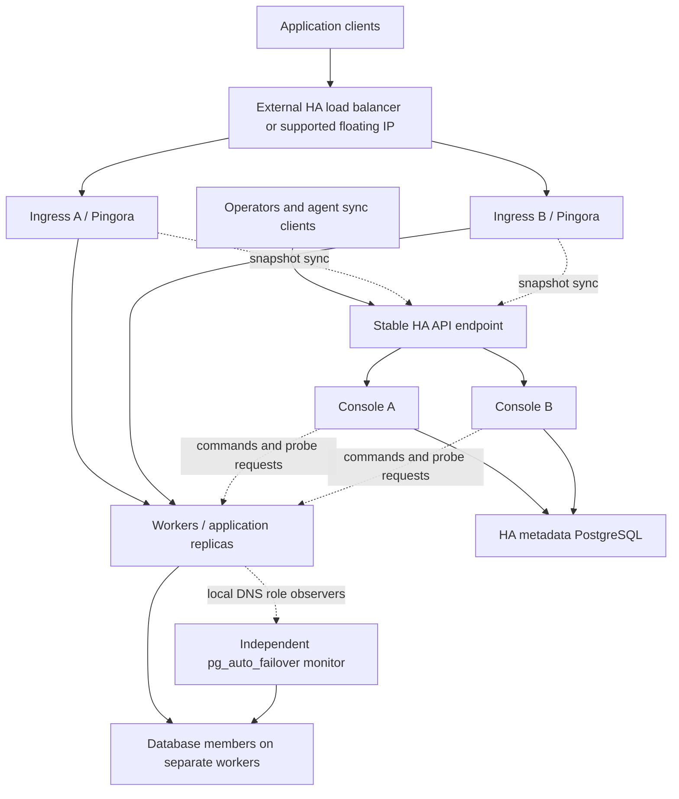

# ADR-045: Multi-node control plane and highly available ingress

<!-- SCOPE: Control-plane replication, independent ingress, worker execution and probes, and database discovery during console outages. -->

**Status:** Proposed; implementation and failure-injection evidence required before advertising HA support.

## Context

Operators need application traffic and database failover to survive losing the server running the Temps console. Separating processes reduces upgrade downtime, but separating processes on one host does not survive that host failing. Adding console replicas alone also does not make ingress, database discovery, or background jobs highly available.

This ADR extends [ADR-017](./017-split-proxy-console-processes.md) and [ADR-011](./011-internal-dns-ha-databases.md). It changes their ownership assumptions for HA installations. Existing all-in-one installations remain supported.

### Verified starting point

Source inspection used local checkout `86dbade268fe41f46e9f9ca1e483df4de26ea727` on 2026-09-19, including existing working-tree changes. This checkout predates the control-plane profile; PR status was checked separately. Existing ADRs describe intent and are not proof of implementation.

| Area | Existing behavior and implication |
|---|---|
| Process separation | [`temps proxy`](../../crates/temps-cli/src/commands/proxy.rs) and [`temps serve --role=console`](../../crates/temps-cli/src/commands/serve/mod.rs) exist. Standalone proxy startup connects to PostgreSQL, maintains its own route cache, and expects a console address. It also attempts local Docker initialization for scale-to-zero. This is not yet a workload-free, database-independent edge process. |
| Workload-free console | [PR #1031](https://github.com/gotempsh/temps/pull/1031), merged September 18, adds `--profile control-plane`. It removes local Docker workload execution. Remote source builds remain follow-up work in [#1034](https://github.com/gotempsh/temps/issues/1034). Profile selection does not establish distributed leadership or ingress failover. |
| Public routing | [`route_table.rs`](../../crates/temps-routes/src/route_table.rs) builds remote backend addresses using worker addresses and published ports. Reachability from one console does not prove reachability from every ingress node. |
| Worker route sync | [`route_sync.rs`](../../crates/temps-routes/src/route_sync.rs) uses a process-local generation that resets on restart. Putting independently generated snapshots behind an API load balancer is unsafe: equal generation numbers can describe different content. |
| Local snapshots | Workers persist internal HTTP routes in [`RouteStore`](../../crates/temps-agent/src/route_store.rs) and DNS in [`ZoneStore`](../../crates/temps-dns-resolver/src/zone_store.rs). These are separate from the standalone public Pingora cache; public ingress cannot inherit their guarantees without implementation. |
| Database roles | [`postgres_role_reconciler.rs`](../../crates/temps-providers/src/externalsvc/postgres_role_reconciler.rs) polls the monitor from the console and publishes role records. [`services.rs`](../../crates/temps-providers/src/services.rs) starts those tasks and deduplicates them inside one process. |
| Resolver outages | [`sync_client.rs`](../../crates/temps-dns-resolver/src/sync_client.rs) retains the last successful zone when the console cannot be reached. DNS TTL expiration does not make the authoritative resolver discover a new primary; it can answer the old address again. |
| Jobs | [`BroadcastQueueService`](../../crates/temps-queue/src/queue.rs) is an in-process broadcast mechanism. It is not a durable cross-console queue. Existing database-backed claim mechanisms must be assessed individually, not replaced indiscriminately. |

### Answer to the reported failure scenario

Today, losing the only ingress IP makes apps unreachable through that IP even if their containers survive. Running a separate proxy process on that same machine does not fix this.

Database promotion and DNS publication are separate operations. With a surviving monitor, eligible standby, and working database network, pg_auto_failover can orchestrate promotion without Temps. If the monitor is lost with the primary, automated promotion cannot be assumed. Keep monitor, primary, and standby in separate failure domains; a separate monitor still needs recovery procedures. See the upstream [fault-tolerance contract](https://pg-auto-failover.readthedocs.io/en/main/fault-tolerance.html).

Even after successful promotion, the current console-owned role reconciler cannot update DNS while all consoles are offline. Worker resolvers retain their snapshot. `primary.<service>.temps.local` is a primary-only record; `<service>.temps.local` is a multi-A set of data members, not a write-primary alias. A client that tries the surviving members and validates writability may still reconnect using that set. This depends on driver behavior and retained member addresses, not on fresh role DNS. PostgreSQL documents [multi-host connections and `target_session_attrs=read-write`](https://www.postgresql.org/docs/16/libpq-connect.html).

## Decision

Support three independently placed roles: **control plane, ingress, and worker**. Use multiple active API replicas, PostgreSQL-backed ownership for mutating controllers, and multiple active Pingora ingress nodes. Keep workload traffic and existing-service database role discovery operational without a live console.

The initial supported HA network is a directly reachable private network or verified mesh. A control-plane host must not be the sole router, WireGuard hub, relay, DNS bootstrap server, or tunnel endpoint between surviving nodes.

Arrows to the API for snapshot sync are management connections, not application request forwarding. Deploy the API front door so it does not depend on routes or certificates fetched from the API it exposes. If the same external balancer serves both front doors, use independent pools and readiness checks.

### 1. Placement and bootstrap

* Run at least two ingress instances and two console instances across different host failure domains. Two consoles are sufficient because they do not form their own consensus quorum; they depend on the metadata database's single writable authority.
* Use a separately bootstrapped HA metadata PostgreSQL service, with a stable writer endpoint, its own promotion/fencing mechanism, backups, and tested client reconnection. Its availability must not depend on Temps scheduling, Temps role DNS, or a Temps-controlled ingress route. Application PostgreSQL HA is a different service and failure boundary.
* Put application replicas on at least two workers. Local volumes, singleton apps, and external dependencies retain their own availability limits. Multiple proxies do not replicate application state.
* Use shared durable object storage for artifacts that must survive a console loss, including applicable build outputs, static-site assets, and backup metadata/artifacts. Inventory local-filesystem dependencies before enabling multiple consoles.
* Share the required cluster cryptographic identity and cookie verification keys through secure bootstrap, with documented rotation. Workers and ingress nodes receive scoped identities, not the console's master encryption key. Sessions, OAuth state, webhook deduplication, and other transient state must work across API replicas without sticky-session correctness assumptions.
* Preserve `serve` defaults. The intended console composition is `serve --role=console --profile control-plane`; validate the combination against the implementation before documenting a deployable recipe. HA ingress requires a new remote-worker mode for `temps proxy`; do not describe today's Docker-backed wake path as sufficient.

### 2. Public ingress: active/active with an independent front door

Domain records point to an external HA load balancer or to an operator-managed floating IP supported by the network provider. That front door selects healthy ingress nodes. Cloudflare Load Balancing is one supported integration candidate; its [monitors remove unhealthy pools from rotation](https://developers.cloudflare.com/load-balancing/monitors/create-monitor/). A floating IP requires provider-specific ownership and fencing, not merely starting the same listener twice.

Plain multi-A DNS and ad-hoc DNS failover scripts are not the reference HA configuration: resolver caching and client address selection prevent a bounded recovery guarantee. The first release will not build a Temps-native public floating-IP controller. A single self-hosted load-balancer VM would simply move the single point of failure.

Every ingress must reach the advertised worker backend through the supported private network. Use worker private address plus published port first, matching current public routes; overlay container addresses require explicit ingress network membership and reachability verification. Never treat an unresolved worker as a local container. Application bytes flow from ingress to workers, never through a console.

Ingress performs bounded active backend checks and passive failure detection independently of console health. Its own reachability view determines which backends it can use. A failed local check ejects a backend from that ingress; it does not authorize rescheduling or deleting it. Preserve connection draining and avoid automatic replay of requests whose upstream execution is uncertain.

Separate process liveness, traffic readiness, and configuration freshness. An ingress with usable routes, valid certificates, and reachable backends stays traffic-ready during console downtime. An ingress without a valid initial snapshot is not ready. A dead backend for one domain produces a route-specific failure and must not automatically withdraw every other application from that ingress.

### 3. Durable snapshots and TLS distribution

Introduce a versioned ingress snapshot API served by any console, containing routes, backend identities, TLS material references, and required policy configuration. Reuse route building and agent sync patterns, but do not expose the current process-local route generation through a load-balanced endpoint unchanged.

Persist immutable revisions identified by `(cluster_id, configuration_epoch, revision)` and a content hash. Allocate revisions under a serialized publication-row transaction so commit order and publication order agree; a bare sequence allocated before commit is insufficient. Publish an authoritative revision pointer only after its content is durable. Desired-state changes and durable reconciliation/outbox records commit together. `LISTEN/NOTIFY` is a wakeup hint; consumers recover from missed notifications by reading the persisted pointer.

A consumer stages and validates a complete revision before an atomic in-memory swap. Reject lower revisions, equal revisions with different hashes, foreign cluster IDs, invalid signatures/identity, and unsupported schemas. Reconnect to any console and obtain identical committed content. Bound snapshot size and retained versions; support full resync after a cursor falls outside retention. Database restore requires an explicit new configuration epoch and operator reconciliation, not accepting a silently reset counter.

Persist the last valid public ingress snapshot and certificate bundle with restrictive permissions and atomic replacement. A warm ingress continues from memory; a restarting ingress may recover from disk while all consoles are down, provided its schema, certificate validity, and policy validity permit serving. Missing/corrupt material leaves it unready. Never assume an in-memory route cache provides cold-start survival.

Coordinate ACME issuance and renewal with durable per-domain jobs and exclusive ownership. Publish certificates to every serving ingress before route activation. HTTP-01 challenge responses must reach any ingress the public balancer can choose; distribute and acknowledge challenge state before validation, or use a configured DNS-01 provider. Keep private keys encrypted in authoritative storage and deliver only assigned certificates over authenticated channels. No independent per-proxy issuance races.

Cached application routes can remain usable during prolonged control-plane failure, but security-sensitive policies need an explicit maximum offline validity and fail-closed behavior at expiry. Domain revocations cannot reach a partitioned proxy immediately; document the bounded revocation window. Certificate expiration remains a hard limit. Rate limits enforced locally multiply across ingress nodes unless budgets are partitioned or shared enforcement is explicitly configured.

Static sites must have reachable shared artifacts or validated local caches. Preview authorization, authentication gates, redirects, and firewall rules need snapshot parity; “HTTP forwarding survives” is not evidence that these features survive.

### 4. Multiple APIs; one owner for each mutating task

All API replicas may accept authenticated requests and persist desired state. Background mutations require durable ownership. Initially use one cluster-controller lease for scheduler/reconciler ownership, plus durable job claims; shard controller ownership by resource only when measured load requires it.

Store lease owner, expiry, and a monotonically increasing fencing token in PostgreSQL. Acquire/renew through conditional transactions using database time. A process that cannot renew stops initiating mutations before its lease expires. Ownership is not inferred from an API health check, hostname, in-memory mutex, or a PostgreSQL notification.

Workers must enforce ownership too. Each mutating command carries cluster/resource identity, desired-state revision, operation ID, fencing token, and a bounded authorization lifetime. Before starting a mutation, the agent validates current authorization against the available control-plane authority and persists its accepted operation/fencing state. A remembered highest token alone is insufficient when a stale leader reaches an agent before its successor does. Agents unable to validate new mutations refuse them; already-running applications continue.

On takeover, reconcile in-flight operations before issuing conflicting work. Bounded operations may finish under the recorded operation ID; destructive work with an uncertain outcome blocks automatic conflicting retries until status or fencing resolves it. Cancellation must not be treated as proof that a remote operation never executed. External provider calls require idempotency keys where available and read-after-failure reconciliation otherwise. Leases cannot provide exactly-once execution across arbitrary external APIs.

Use durable at-least-once jobs with transactional claims, claim expiry/renewal, attempts, idempotency keys, and terminal outcomes. Reuse suitable existing job tables. In-process broadcasts remain acceleration only. A successful API response that accepts work must mean the operation survives process death.

| Activity | HA owner |
|---|---|
| API reads and desired-state writes | Any console, database transactions and authorization |
| Scheduling, rollout transitions, scale-down, node-loss decisions | Leased controller; durable operations to workers |
| Builds, deploy execution, exec, logs, service creation, backups/restores | Target workers; durable claims and scoped command authorization |
| Cron, backup schedules, notifications, certificate renewal | Durable deduplicated jobs; one claim per scheduled occurrence |
| Proxy route serving and backend ejection | Each ingress independently |
| Workload health probes and database monitor queries | Worker-side execution; observations tagged with origin and freshness |
| Database promotion | pg_auto_failover monitor and keepers; never Temps probe voting |
| Migration execution | One explicit migration owner before new API replicas become ready |

Metadata failover must fence the old writer and preserve acknowledged coordination state. Asynchronous loss of lease/operation records can resurrect stale authorization; automatic takeover is unsafe in that case. Require no acknowledged coordination-data loss for automatic recovery, or stop mutations for explicit recovery/epoch reset. Avoid introducing a second consensus system in Temps.

### 5. Thin control plane: worker execution and probes

Control-plane machines require API/database connectivity and authenticated access to agents. They do not require Docker, application overlay membership, or direct TCP access to workload ports.

Define a typed worker probe contract keyed by node, service/deployment, container incarnation, probe type, and desired revision. The agent resolves allowed target addresses and ports from its assignment; the caller cannot supply an arbitrary network destination. Support TCP-connect, HTTP readiness, and engine-specific role/monitor observations separately. A successful TCP connection is not proof that PostgreSQL is primary or that an HTTP application is ready.

Run local readiness checks on the hosting worker. For cross-worker reachability checks, assign a probe from the worker that needs that path. Ingress still checks its own ingress-to-backend path. Return observed time, elapsed duration, result, and typed contextual errors. Reject late observations from replaced containers and classify expired observations as unknown, not healthy or conclusively dead. Batch reports, cap concurrency/timeouts, and jitter schedules.

The current Postgres role reconciler's direct console-to-monitor SQL connection moves to this worker observation mechanism. Console replicas consume observations for UI and inventory; DNS continuity must not depend on those reports reaching a console.

Scale-to-zero wake becomes a durable environment operation delivered to its assigned worker, deduplicated across proxies. Aggregate activity across ingress instances before sleeping an environment: one idle proxy cannot stop an app another proxy is serving. During a total control-plane outage, running workloads remain available, new wakes may return a clear retryable 503, and automatic sleep is disabled. Do not grant ingress nodes unrestricted Docker access to work around this limit.

### 6. Database role discovery without any console

Add an opt-in HA role-observation mode to each worker resolver. The console distributes durable service membership, monitor endpoints, allowed member identities, probe credentials, and a policy/configuration revision. Workers persist this configuration independently of the observed role result.

Each participating worker runs one bounded background observer per subscribed database service. It queries the existing monitor through an authenticated, least-privilege channel and checks the selected member's actual PostgreSQL role/readiness. It does not promote databases, elect a primary, or infer authority from a TCP port being open. Provision this observation path before declaring the service HA-ready; the current monitor query's trust-auth assumption is not an acceptable general remote credential model.

Separate the resolver's console-owned membership zone from a local, short-lived role view. For services migrated to this mode, disable console publication of competing role aliases. The local observer is the only authority for their `primary.*` and `replica.*` answers. Merge at lookup time according to configured ownership; never let an old console snapshot overwrite fresher observations. Report observations to the console when available, without making publication depend on that acknowledgement.

Require a fresh, unambiguous monitor observation and matching member role before advertising a new primary. No primary or multiple primary candidates means no writable alias; return SERVFAIL for an existing role name whose current answer cannot be established. Do not select the first apparent primary. These checks do not replace pg_auto_failover's fencing guarantees.

Role results expire independently of DNS TTL. Bound DNS response TTL by remaining observation validity; after expiry, return SERVFAIL rather than reissuing an old primary address. Persisted role answers are untrusted after restart until refreshed. Monitor loss therefore degrades role aliases once their validity expires, even when an existing database connection still works. This is an explicit availability-versus-stale-routing tradeoff.

Keep `<service>.temps.local` semantics as member discovery, not primary-only routing. Persist stable member names/addresses and recommend multi-host, role-validating clients where supported. Member discovery does not expire merely because role observation is unavailable; membership changes still need a console. Client pools must reconnect after promotion, and neither DNS nor a future L4 proxy can migrate established database sessions. Application caches that ignore TTL are outside the DNS recovery bound.

Total console outage is supported for discovery among previously configured members while the monitor, observers, and worker network remain healthy. Creating members, replacing their addresses, rotating expired credentials, and changing policy still require the control plane. If the monitor also fails, Temps does not invent a replacement election protocol.

### 7. Network and related ADR boundaries

An unpublished local draft, “Internal L4 service proxy,” proposes a control-plane-brokered relay fallback. Such a fallback cannot carry an HA guarantee during total control-plane failure. HA mode requires direct worker connectivity or a separately redundant data-plane relay with independent discovery and lifecycle. This ADR does not implement that relay or require L4 service VIPs for the first release.

An unpublished local draft, “Multi-node join flow redesign,” addresses enrollment and signaling, not runtime packet-path redundancy. Joining successfully is not a connectivity test. Persist peer configuration and verify the worker-to-worker, ingress-to-worker, observer-to-monitor, and database replication paths while control-plane hosts are powered off.

Use a stable API URL with redundant backends for agent heartbeats, enrollment, route/DNS sync, and operation status. A single configured URL is acceptable only if its front door is HA. Certificates and node authorization must validate consistently on every console. Draining a console terminates long polls cleanly so clients reconnect elsewhere.

## Failure contract

These are target guarantees after the corresponding phases pass validation, not current product claims.

| Failure | Existing application traffic | Management / database implications |
|---|---|---|
| One ingress lost | New connections use surviving ingress after external detection; connections through failed node drop | No console failover required |
| One console lost | Unaffected | API requests retry elsewhere; controller/job ownership recovers with fencing |
| All consoles lost | Running reachable replicas continue through cached ingress, within cert/policy validity | No deploys or new wake guarantees; autonomous role DNS continues for configured members if monitor/network survive |
| Metadata writer unavailable | Same cached traffic guarantee | Mutations stop until a correctly fenced writer returns; worker role observers do not depend on metadata DB |
| One worker lost | Surviving app replicas serve after ingress ejection | Replacement scheduling needs console + metadata; singleton/local-volume workloads can fail |
| Database primary lost | Apps may fail temporarily and must reconnect | Monitor/keepers perform failover; observers refresh aliases after safe promotion |
| Monitor lost | App ingress unaffected; established database service may continue | No automatic database failover guarantee; role aliases fail closed after observation expiry |
| Console or worker partition | Each ingress uses its reachable backends | Stale controllers cannot mutate; isolated observers expire roles; unknown health does not justify destructive replacement |
| Ingress restarts with consoles down | Works only with usable durable snapshot, certs/policies, artifacts, and worker paths | Otherwise stays unready; no blank/default routing fallback |
| Public front door lost | Public traffic fails unless front door itself is redundant | Outside the protection of simply adding Temps instances |

Recovery is not instantaneous. Measure ingress recovery as detection + endpoint withdrawal + client reconnect; role-DNS recovery as database promotion + observation + DNS/client cache + reconnect; controller recovery as lease expiry + acquisition + operation reconciliation. RPO belongs to each storage system, not to the number of console replicas.

## Alternatives considered

| Alternative | Decision |
|---|---|
| Run several unmodified consoles against one database | Reject: duplicate schedulers, process-local queues/generations, local resources, and unfenced remote actions remain |
| Split proxy and console on one server | Retain for independent upgrades; does not provide host HA |
| Multiple proxies reading PostgreSQL directly forever | Useful migration step; reject as final boundary because cold start, schema coupling, credentials, and request-adjacent services remain tied to metadata availability |
| Add etcd/Raft for control-plane leadership | Defer: adds a second quorum and operations burden; PostgreSQL is already required. Revisit if its coordination load becomes a measured bottleneck |
| Only move the database monitor to a worker | Necessary placement improvement; insufficient for console-owned DNS publication and public ingress |
| Only replicate the DNS reconciler across consoles | Handles one console failure, not all consoles failing; retain as transitional behavior only |
| Make worker observers elect a database primary | Reject: would compete with pg_auto_failover and weaken fencing safety |
| Build native public DNS failover/floating IP first | Defer: provider/network-specific and does not solve internal job ownership or DNS role freshness |

## Implementation sequence and release gates

1. **Record current failure modes and establish the thin-console boundary.** Build on #1031 and track #1034 separately. Inventory every startup task, local filesystem dependency, probe, and mutation path. Verify no-workload console behavior. Add a visible HA readiness page even when prerequisites are missing.
2. **Ship independently redundant ingress.** Add remote-worker proxy mode, durable route/policy/certificate snapshots, durable revisions, proxy-side health checks, and external-front-door documentation. Prove console-off traffic and cold-start recovery. Keep a single console supported here; label this ingress HA, not control-plane HA.
3. **Ship worker probes and autonomous role DNS.** Implement authenticated observation configuration, explicit zone ownership, expiry, and role validation. Enable per service only after every consuming resolver supports the new protocol and acknowledges configuration. Prove primary failover with all consoles stopped.
4. **Make mutations safe to replicate.** Add leases, worker-enforced authorization, durable jobs/outbox, migration ownership, distributed session state, shared artifacts, and takeover reconciliation. Audit all plugin startup loops before starting a second active console. Reuse existing durable claims where correct.
5. **Enable and qualify multi-console deployments.** Introduce redundant API endpoint onboarding, rolling upgrade/drain behavior, and failure tests against HA metadata storage. Publish tested recovery measurements and limitations. Security-auditor sign-off is required before merging identity, remote-command, certificate, or fencing changes.

Use expand/contract schema changes and versioned snapshot/agent protocols. Negotiate capabilities per node and refuse HA activation when required consumers are old. Roll back binaries only within the supported schema/protocol window; switching database role authority back to the console requires an acknowledged configuration transition so both publishers cannot compete.

Suggested ownership: CLI wiring in `temps-cli`; publication contracts in `temps-routes`; ingress serving in `temps-proxy`; durable coordination in `temps-core`/`temps-queue` with entities/migrations in their existing crates; worker commands/observations in `temps-agent`; PostgreSQL-specific interpretation in `temps-providers`; lookup ownership and expiry in `temps-dns-resolver`. Extract a new coordination crate only if dependency boundaries require it.

## Verification and observability

Unit tests cover lease expiry, fencing rejection, idempotency, stale observations, ambiguous roles, snapshot rollback/hash mismatch, policy expiry, and typed error conversion. Database integration tests use real PostgreSQL for competing claims, transaction rollback, publication ordering, reconnects, and retained outbox recovery. Runtime acceptance requires real multi-node failure injection:

* Kill ingress A under HTTP, TLS, streaming, and WebSocket traffic; verify new connections recover through B and record dropped established connections.
* Stop all consoles, then restart an ingress from disk. Exercise app routes, static sites, authentication policies, and certificate validity boundaries.
* With all consoles stopped, lose a database primary; verify promotion through the surviving monitor and fresh role answers on every consuming worker. Repeat with monitor loss, expired observations, asymmetric partitions, and client pools that cache DNS.
* Pause the controller beyond its lease, elect a successor, then resume it. Deliver the stale command before the new controller contacts that worker; assert rejection. Crash between remote side effect and acknowledgement; assert safe reconciliation without duplicate destructive work.
* Fail over metadata PostgreSQL during claims/publication. Test missed notifications, equal-revision/different-content responses, database restore, and reconnecting clients against different consoles.
* Partition worker paths while agent heartbeats remain healthy; distinguish path failure from workload failure. Stop every control-plane network interface to expose hidden tunnel dependencies.
* Validate rolling versions, certificate renewal through either ingress, scale-to-zero activity across proxies, bounded queues, and recoverable telemetry-storage outages.

Use existing MockDatabase/TestDatabase conventions, Docker-aware runtime skips, targeted crate tests, and warning-free `cargo check --lib` for implementation. Skipped multi-host tests are not release evidence; the HA qualification environment must actually run them.

Expose ingress/backend readiness, current/applied/durable revision, snapshot age, cert expiry, controller owner and lease expiry, claim retries, rejected fencing tokens, role-observation age, resolver SERVFAIL reasons, and per-path reachability. Provide direct setup links for missing external LB, second ingress/console, shared storage, database authority, worker placement, and monitor separation. Distinguish “configured” from “tested under failure.”

Keep request forwarding free of control-plane/database calls. Use immutable route/policy snapshots, bounded telemetry queues, batch flushes, bounded probe fan-out, and cursor-based reconciliation. Qualify the proxy at the repository's 100k requests/s reference load on a 3 vCPU / 4 GB host; report throughput, latency, memory, and saturation behavior rather than promising unchanged performance. Cap PostgreSQL connections across all replicas; more consoles must not exhaust the metadata database.

## Consequences

Operators can upgrade consoles without tying app availability to that lifecycle, then add console replicas for management continuity. Database role discovery becomes resilient to a total console outage for already configured services. The cost is durable distributed coordination, more explicit state ownership, secure snapshot/credential distribution, and a stronger operational contract for the metadata database and network.

We will not claim uninterrupted established connections, HA for singleton local-volume apps, automatic database failover without the monitor, or unrestricted management during metadata loss. The roadmap separates ingress HA, database discovery continuity, and control-plane HA so each can ship with evidence instead of one ambiguous “multi-master” label.

---

**Owner:** Temps maintainers. **Last reviewed:** 2026-09-19. Revisit when proxy sync, node enrollment, role DNS, job ownership, metadata failover, or the related ADRs change.
