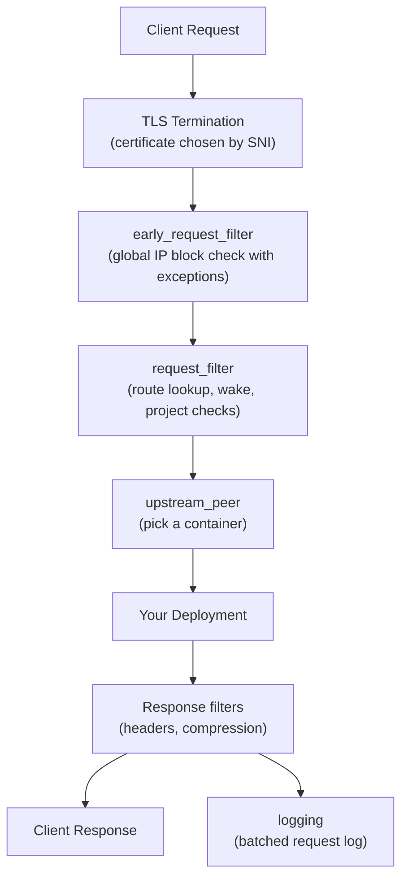
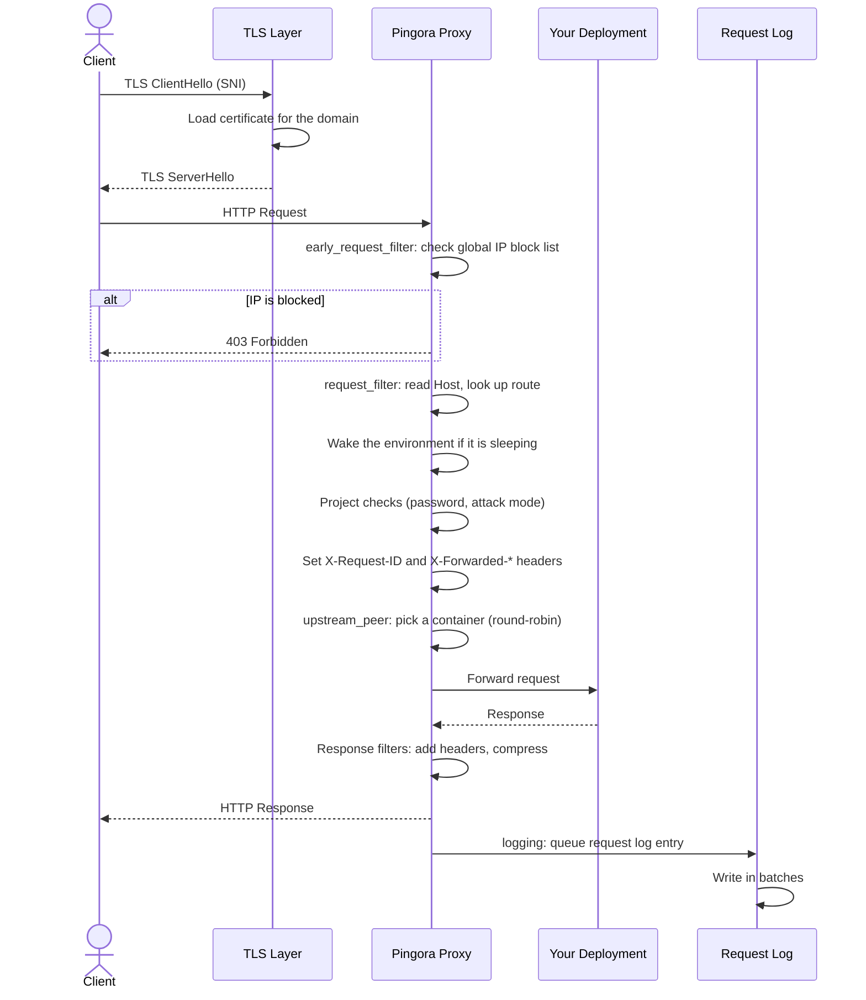
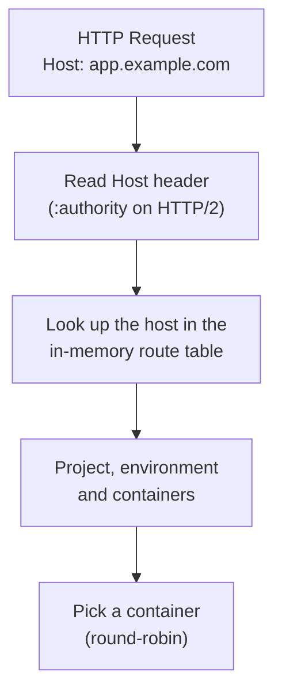
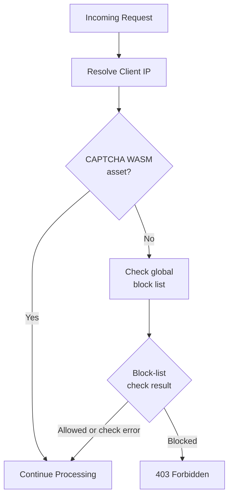
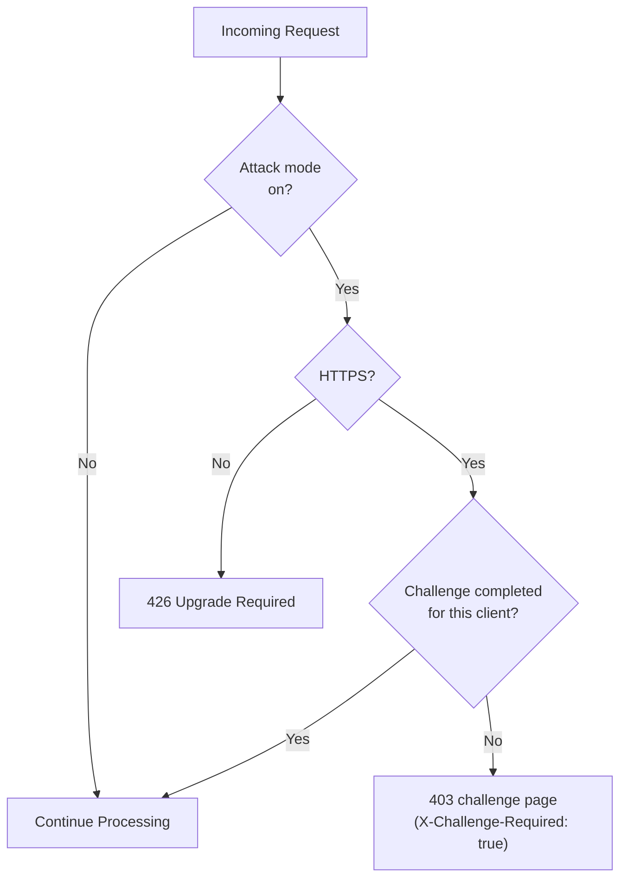

export const metadata = {
  title: 'Request Flow',
  description: 'Understanding how requests flow through Temps from client to deployment and back.',
  alternates: {
    canonical: '/docs/request-flow',
  },
}

export const sections = [
  { title: 'Overview', id: 'overview' },
  { title: 'Request Lifecycle', id: 'lifecycle' },
  { title: 'Processing Phases', id: 'phases' },
  { title: 'Project Resolution', id: 'project-resolution' },
  { title: 'Security Checks', id: 'security-checks' },
]

# Request Flow

Understanding how HTTP requests flow through Temps from the client to your deployment and back. {{ className: 'lead' }}

---

## Overview {{ anchor: true, id: 'overview' }}

Requests to your Temps-hosted application pass through TLS termination for HTTPS, an early global IP block check, route resolution, optional project security checks, and forwarding to one of the environment's containers. Sleeping (scale-to-zero) environments are woken on the way. The IP check has the exceptions described under IP Access Control below.

### High-Level Flow

---

## Request Lifecycle {{ anchor: true, id: 'lifecycle' }}

### Complete Request Flow

---

## Processing Phases {{ anchor: true, id: 'phases' }}

Temps implements Pingora's `ProxyHttp` trait. These are the hooks that do the work, in the order a request reaches them:

| Hook | What Temps does there |
| ---- | --------------------- |
| `early_request_filter` | Checks the client IP against the global block list and returns `403` for blocked addresses, except for CAPTCHA WASM assets. If the check errors, the request continues. Decides whether the response may be compressed (not for SSE, WebSocket or other streaming requests) and whether the client asked for Markdown. |
| `request_filter` | Sets `X-Request-ID`, reads the host, wakes sleeping environments, resolves the project and environment from the route table, and runs project checks: preview and password protection, and the attack-mode challenge. Sets the forwarded headers. |
| `upstream_peer` | Picks the container that serves the request (round-robin across the environment's containers) and applies the environment's request timeouts. Hosts with no route go to the console. |
| `upstream_response_filter` | Adjusts the response from your app, for example adding `X-Served-By` with the name of the container that handled it. |
| `response_filter` / `response_body_filter` | Final response headers, including security headers, and the HTML-to-Markdown conversion when the client asked for `text/markdown`. |
| `fail_to_connect` | Retries the request once if the proxy can't connect to the container. |
| `logging` | Queues a request log entry. |

### What the proxy does to requests and responses

- **Response compression**: responses are compressed for clients that accept it (level 6). Compression is turned off for SSE, WebSocket and other streaming responses.
- **Markdown responses**: when a client sends `Accept: text/markdown`, the proxy asks your app for an uncompressed HTML page and converts it to Markdown. Your app's response is never decompressed by the proxy.
- **Visitor cookies**: the proxy sets visitor and session cookies used by Temps analytics.
- **Security headers**: headers such as `Content-Security-Policy`, `X-Frame-Options`, `Strict-Transport-Security` and `Referrer-Policy` come from the project's security settings or the global defaults.
- **Response headers**: `X-Request-ID`, `X-Response-Time` and `X-Served-By`.

The proxy does not compress request bodies, decompress responses, or inject scripts or tracking pixels into your pages.

### Request logging

Request log entries are sent to a bounded in-memory queue and written in batches of up to 200 entries when a batch fills or on a 500 ms flush interval, to the `proxy_logs` table (or ClickHouse, when configured). If the queue is full, new entries are dropped rather than slowing down requests.

---

## Project Resolution {{ anchor: true, id: 'project-resolution' }}

### Host to Project Mapping

When a request arrives, Temps determines which project and environment should handle it:

### Resolution Steps

1. **Read the hostname** from the `Host` header, or `:authority` on HTTP/2. TLS SNI is only used to choose the certificate.
2. **Look up the route** in the proxy's in-memory route table. The table is loaded from the database and reloaded when routes change, so requests don't query the database.
3. **Resolve the project and environment** that the route belongs to.
4. **Pick a container** from the environment's running containers, using round-robin.

### Fallback Behavior

If no route matches the host, the request is forwarded to the Temps console, which answers it.

---

## Security Checks {{ anchor: true, id: 'security-checks' }}

### IP Access Control

Early in request processing, the proxy normally checks the resolved client IP against the global block list. CAPTCHA WASM assets bypass the check, and a lookup error lets the request continue:

**IP Rules**:
- **Block rules** (single IPs or CIDR ranges) apply across projects. A matching blocked IP gets `403 Forbidden` when the check succeeds.
- Requests for `/api/__temps/temps_captcha_wasm*` bypass the block check so the challenge assets remain available.
- If the IP access service returns an error, the proxy logs it and lets the request continue (fail-open).
- **Allow rules** can be saved but currently have no effect.
- There are no per-project IP rules.
- **Default**: all IPs are allowed.

### Attack Mode Challenge

When **attack mode** is on for a project or environment, visitors must complete a challenge before reaching your app:

- Attack mode is the only trigger. The challenge isn't shown based on new IPs, traffic patterns or rate limits.
- It requires HTTPS, because the client is identified by its TLS fingerprint (JA4). Plain HTTP requests get `426 Upgrade Required`.
- A completed challenge is remembered per environment for that client.

The only rate limits in the proxy apply to repeated failed attempts at preview and password-protected pages.

### Request Headers Added

Temps sets these headers on requests forwarded to your deployment:

- `X-Request-ID`: unique identifier for this request (also returned in the response)
- `X-Forwarded-For`: the client IP as resolved by Temps
- `X-Forwarded-Proto`: the original protocol (`http` or `https`)
- `X-Forwarded-Host` and `X-Forwarded-Port`: the public host and port the client used
- `Host`: the public host

The client-supplied `Forwarded`, `X-Real-IP` and `CF-Connecting-IP` headers are removed, so your app can't be given a forged client IP through them.

---

## Additional Resources

  <Button href="/docs/overview" variant="text" arrow="left">
    Architecture Overview
  </Button>
  <Button href="/docs/plugins" variant="text" arrow="right">
    Plugin System
  </Button>

