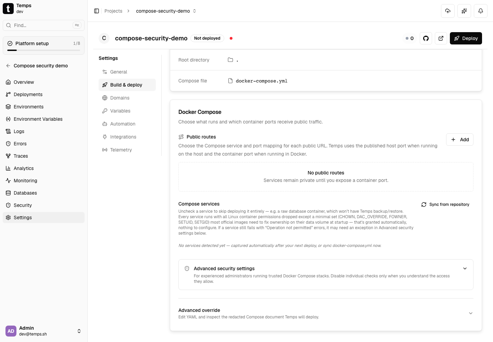
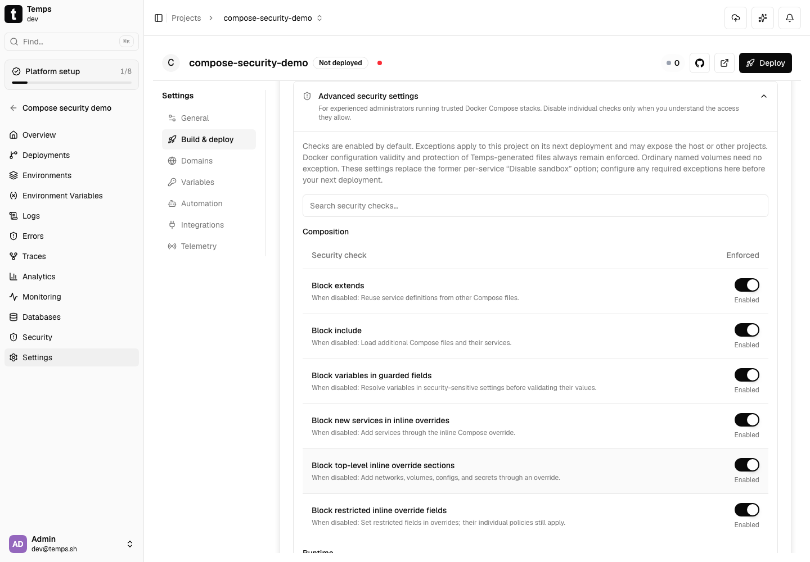
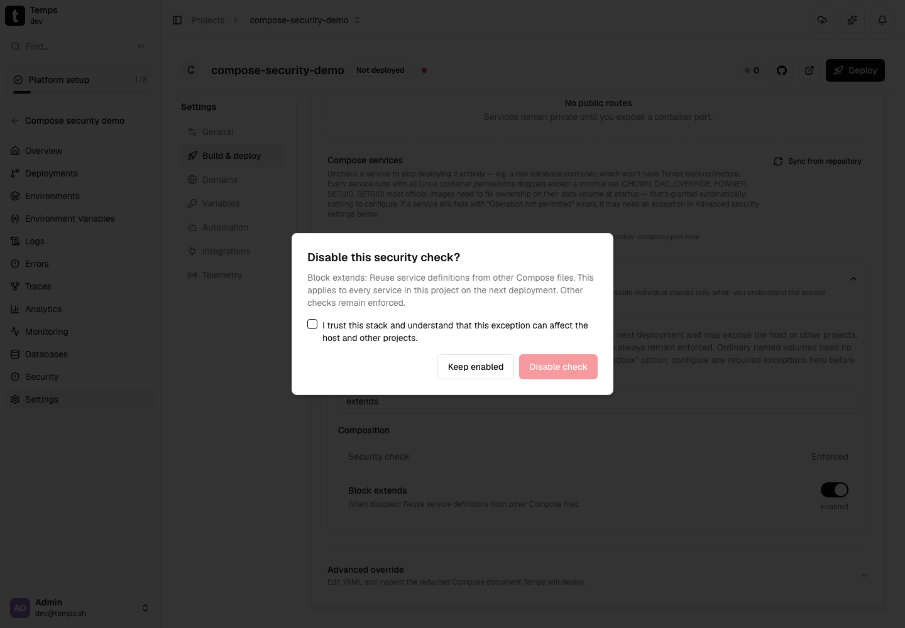
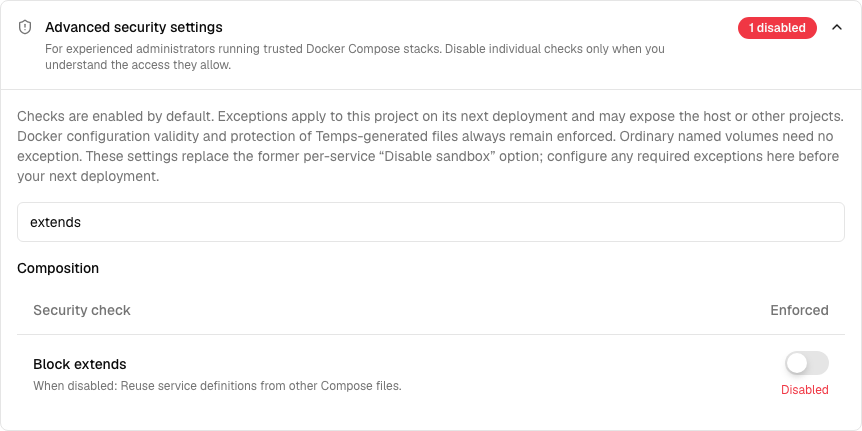
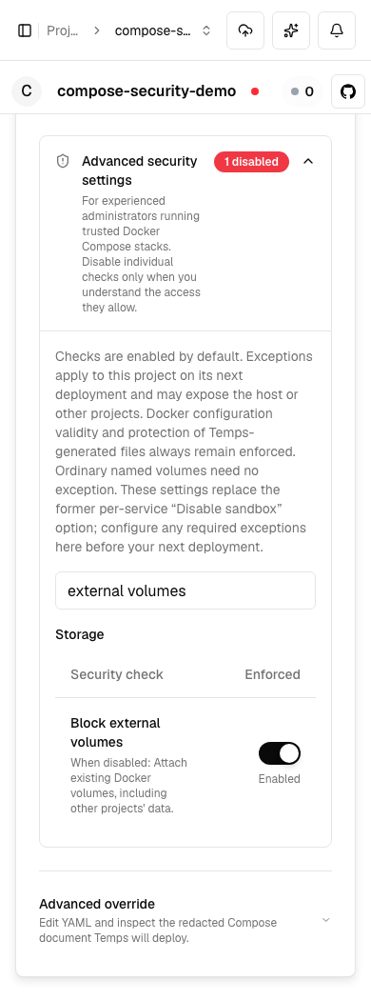

# Compose security UX evidence

Captured from the running local application on 2026-09-20, using PR #1057
commit `716cf9f91a23e766e943e1291d3088360dd8b579` after merging main.
Desktop viewport: 1440 × 1000. Mobile viewport: 390 × 1050.

Python Playwright created an isolated, undeployed Compose project, opened
Settings → Build & deploy → Build, verified the collapsed default and all
80 security switches, then opened the `extends` confirmation dialog,
acknowledged the risk, and saved the exception. Captures also show the
disabled-check count and external-volume controls on mobile. No API
responses were mocked. The temporary project was deleted after capture.

Capture command (local temporary automation script):

```sh
python3 /tmp/compose-ux-review/capture.py
```

Actual output:

```text
Captured six screenshots; all 80 controls loaded and acknowledgment/save succeeded.
Temporary project cleaned up: True
```

Five representative captures are retained below; the broad volume-list
capture is omitted because the scroll container clipped the lower rows.
No runtime code changed in this evidence update.

## Collapsed by default



## Expanded security checks



## Risk acknowledgment dialog



## Saved extends exception



## Mobile external-volume controls


