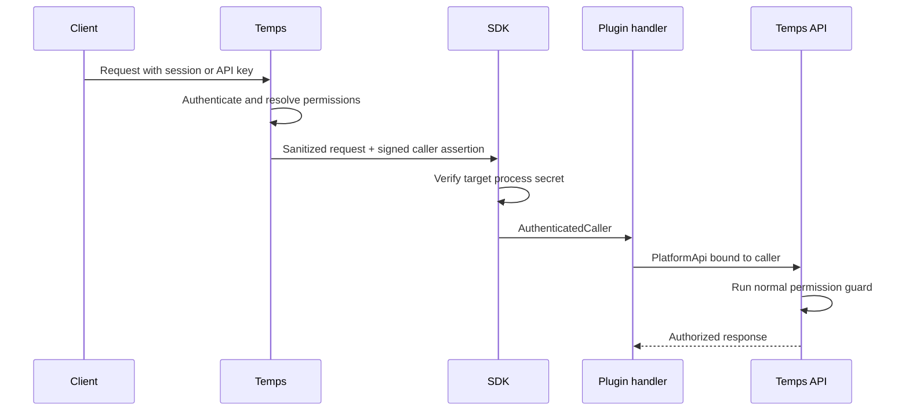

export const metadata = {
  title: 'External Plugin SDK',
  description: 'Authenticate external plugin routes and call the Temps platform API with the permissions of the initiating user.',
  alternates: {
    canonical: '/docs/reference/external-plugin-sdk',
  },
}

export const sections = [
  { title: 'Security model', id: 'security-model' },
  { title: 'Before and after', id: 'before-after' },
  { title: 'Protect a route', id: 'protect-a-route' },
  { title: 'Check permissions', id: 'check-permissions' },
  { title: 'Call the platform API', id: 'call-platform-api' },
  { title: 'Background work', id: 'background-work' },
  { title: 'Declare capabilities', id: 'declare-capabilities' },
  { title: 'Public routes', id: 'public-routes' },
  { title: 'Available operations', id: 'available-operations' },
  { title: 'Compatibility and errors', id: 'compatibility-errors' },
]

# External Plugin SDK

Use `temps-plugin-sdk` to authenticate external plugin routes and call the Temps API as the user who started the request. Temps remains responsible for sessions, API keys, roles, and platform authorization. {{ className: 'lead' }}

---

## Security model {{ anchor: true, id: 'security-model' }}

An external plugin runs as a separate process. Temps reaches it through a private Unix socket and mounts its routes at:

```text
/api/x/{plugin-name}/*
```

For every proxied request, Temps:

1. Authenticates the browser session, API key, or CLI token.
2. Resolves the caller's effective permissions.
3. Removes the original `Cookie`, `Authorization`, `Proxy-Authorization`, and caller-supplied `x-temps-*` headers.
4. Adds a signed caller assertion for the target plugin process.
5. Lets the SDK verify that assertion before the plugin router runs.

Temps also authenticates the internal WebSocket channel and event-delivery
endpoint with the process-specific secret. Socket permissions limit access to
the host process user, and an unauthenticated connection cannot consume the
single accepted channel slot.

The result is an important request boundary: plugin handlers consume a
verified caller object instead of parsing identity headers themselves.

Installed plugins are nevertheless fully trusted host code. They currently
run as the Temps operating-system user and are not sandboxed from the instance
filesystem or sibling processes. Per-process secrets and manifest capabilities
prevent accidental request-authority widening; they do not contain a malicious
plugin binary. Untrusted plugins require a separate UID, container, or
equivalent sandbox with plugin-scoped storage and credentials.



The SDK does not grant extra access. A delegated call is checked by the same platform handler and permission guard as a direct API request.

---

## Before and after {{ anchor: true, id: 'before-after' }}

Before this boundary, an external plugin could query a limited read-only channel, but it had no safe general way to call the platform API for the current user. A plugin that needed to create a project or deployment had to add a parallel host integration, handle forwarded identity itself, or retain a user token for later work. Those approaches could drift from the main API's authorization rules or select the wrong credential when one user had multiple sessions and API keys.

After this boundary, Temps authenticates once and the SDK exposes the verified result. The plugin receives typed caller data, checks the caller's resolved permissions for plugin-owned resources, and derives a `PlatformApi` bound to that exact request when it needs platform work.

| Before | After |
| --- | --- |
| Plugin handlers parsed forwarded identity data | SDK extractors return a verified `AuthenticatedCaller` |
| A role name could be mistaken for the caller's full authority | The resolved permission set preserves API-key narrowing |
| Background work could look up a credential by user ID | Background work owns the exact initiating `PlatformApi` |
| Platform mutations needed parallel integration code | Typed calls reuse existing platform HTTP handlers and permission guards |
| One shared proxy secret covered every plugin process | Every plugin process has its own secret delivered outside argv and environment variables |
| Plugins received database and host values by default | Privileged launch values are declared independently and disabled by default |
| An old binary failed after partial startup | A versioned staged handshake returns an actionable incompatibility error |
| Plugins could guess public scheme, host, or port | `mount_url()` uses the host's configured public origin |

---

## Protect a route {{ anchor: true, id: 'protect-a-route' }}

Use `AuthenticatedCaller` as an Axum extractor for a route that requires a signed-in Temps user:

```rust
use axum::{routing::get, Json, Router};
use serde_json::{json, Value};
use temps_plugin_sdk::{AuthenticatedCaller, PluginContext};

async fn profile(caller: AuthenticatedCaller) -> Json<Value> {
    Json(json!({
        "user_id": caller.user_id,
        "email": caller.email,
        "role": caller.role,
        "request_id": caller.request_id,
    }))
}

fn router(ctx: PluginContext) -> Router {
    Router::new()
        .route("/profile", get(profile))
        .with_state(ctx)
}
```

If the request has no verified user, the extractor returns `401 Authentication Required` using a Problem Details response.

For a route that supports both anonymous and authenticated callers, use `OptionalCaller`:

```rust
use temps_plugin_sdk::OptionalCaller;

async fn landing(OptionalCaller(caller): OptionalCaller) -> String {
    match caller {
        Some(caller) => format!("Welcome back, {}", caller.email),
        None => "Welcome".to_string(),
    }
}
```

Do not read `x-temps-user-*` headers in your handler. The typed extractors only return data inserted after the SDK verifies the request came from Temps.

---

## Check permissions {{ anchor: true, id: 'check-permissions' }}

Authorize plugin-owned resources with `has_permission`:

```rust
use axum::http::StatusCode;
use temps_plugin_sdk::{AuthenticatedCaller, PluginPermission};

async fn create_widget(caller: AuthenticatedCaller) -> Result<String, StatusCode> {
    if !caller.has_permission(PluginPermission::PROJECTS_WRITE) {
        return Err(StatusCode::FORBIDDEN);
    }

    Ok("created".to_string())
}
```

Check the resolved permission set, not only the role. An API key can use an administrator account while being intentionally narrowed to `projects:read`. Reconstructing permissions from `caller.role` would silently widen that key.

`PluginPermission` keeps permission names as validated strings. This allows a plugin built with an older SDK to accept new permission names added by a newer Temps release.

---

## Call the platform API {{ anchor: true, id: 'call-platform-api' }}

Convert the verified caller into a typed, caller-scoped `PlatformApi`:

```rust
use temps_plugin_sdk::{api::ProjectPage, AuthenticatedCaller, PluginContext, PluginSdkError};

async fn load_projects(
    ctx: &PluginContext,
    caller: &AuthenticatedCaller,
) -> Result<ProjectPage, PluginSdkError> {
    let api = ctx.api_as_caller(caller)?;
    api.list_projects(1, 50).await
}
```

`PlatformApi` carries the short-lived actor issued for this exact request. Temps verifies the actor and executes the existing HTTP handler as that user. Project membership, API-key restrictions, and endpoint permission guards still apply.

Do not construct a platform client from a user ID, store raw actor tokens, or select the "most recent" credential for a user. Those patterns can swap a restricted API key for a broader browser session.

---

## Background work {{ anchor: true, id: 'background-work' }}

Create the `PlatformApi` while the verified request is in scope, then move the typed client into the background task:

```rust
let api = ctx.api_as_caller(&caller)?;

tokio::spawn(async move {
    if let Err(error) = run_deployment(api).await {
        tracing::error!(%error, "background deployment failed");
    }
});
```

This preserves the exact initiating authority without maintaining a global user-to-token registry. The actor is short-lived, so long-running work must surface expiry as an actionable error and ask the user to retry.

---

## Declare capabilities {{ anchor: true, id: 'declare-capabilities' }}

Platform calls require a coarse capability in the plugin manifest:

```rust
use temps_plugin_sdk::{PluginCapability, PluginManifest};

let manifest = PluginManifest::builder("example-plugin", "1.0.0")
    .capability(PluginCapability::ApiRead)
    .capability(PluginCapability::ApiWrite)
    .build();
```

| Capability | Allows |
| --- | --- |
| `ApiRead` | Calls using HTTP `GET` |
| `ApiWrite` | Calls that create, update, or delete platform resources |

Capabilities describe the maximum class of calls a plugin intends to make. They never override the caller's permissions. A request must pass both checks:

1. The plugin manifest declares the required capability.
2. The initiating caller is authorized by the platform endpoint.

Declare only what the plugin needs. A plugin that only lists projects should request `ApiRead`, not `ApiWrite`.

Database and host-data access are separate privileged launch disclosures, not
ordinary API capabilities:

```rust
let manifest = PluginManifest::builder("trusted-maintenance-plugin", "1.0.0")
    .requires_db(true)
    .requires_host_data_access(true)
    .build();
```

`requires_db(true)` exposes the control-plane database URL.
`requires_host_data_access(true)` exposes the instance data root, which may
contain encryption and authentication keys. The flags minimize supplied data
and disclose intent; they are not sandbox enforcement under the current
shared-UID runtime. Use caller-scoped API operations for normal plugins, and
enable these settings only for audited binaries that cannot function through
the SDK boundary.

---

## Public routes {{ anchor: true, id: 'public-routes' }}

Protected routes are the default. Use `public_path` only when a route authenticates itself, such as a signed webhook or a capability URL:

```rust
let manifest = PluginManifest::builder("example-plugin", "1.0.0")
    .public_path("/webhooks/provider")
    .build();
```

The path is relative to the plugin mount and matches by prefix. A public path bypasses Temps user authentication and is reachable by anyone who can reach the instance. The handler must validate its own credential before doing work.

Public requests have no platform user to delegate. `api_as_caller` is therefore unavailable for them.

---

## Available operations {{ anchor: true, id: 'available-operations' }}

The caller-scoped API currently provides typed operations for:

| Area | Operations |
| --- | --- |
| Projects | List visible projects, create, fetch, and update a project |
| Environments | List a project's environments |
| Deployments | Deploy a static bundle, deploy a registry image, securely claim a host-local image, upload an image archive, and poll a deployment |
| Managed services | Create a service, link it to a project, and issue audited runtime credentials |

Endpoint declarations are checked against Temps' generated OpenAPI schema by `crates/temps-cli/tests/plugin_sdk_conformance.rs`. A renamed route, changed verb, or incompatible response field fails CI instead of becoming a runtime `404` or deserialization error.

For URLs exposed outside the plugin process, use `PluginContext::mount_url()`. It derives the externally reachable `/api/x/{plugin-name}` URL from the host configuration; do not guess the scheme, hostname, or port.

---

## Compatibility and errors {{ anchor: true, id: 'compatibility-errors' }}

Treat these errors separately when presenting them to an operator:

| Error | Meaning |
| --- | --- |
| `NoActor` | The request has no caller delegation, usually because it is public or the manifest declares no API capability |
| `ApiStatus` | Temps rejected the delegated API call; the error includes the HTTP status and Problem Details body |
| `BodyTooLarge` | A multipart payload exceeds the platform channel limit |
| `Deserialization` | The response no longer matches the SDK projection |

SDK response types are projections of the platform's public OpenAPI models. Required fields are verified by the conformance test, while optional fields allow compatible additions across releases.

External plugins are separate binaries and must be rebuilt when adopting a breaking SDK protocol change. Keep the plugin SDK revision aligned with the Temps version used to build and test the plugin.

Temps uses a versioned, staged startup handshake. A single plugin process first
publishes its manifest, then Temps sends typed launch configuration over the
process's protected stdin. Database credentials and the request-assertion
secret never appear in command-line arguments, and there is no second binary
execution between inspection and startup. A legacy binary or protocol mismatch
is rejected with an explicit rebuild instruction.

For a host-local image built by an explicitly trusted plugin, set
`claim_local: true` through the typed deploy-image operation. Temps inspects the
source image, retags it into a generated project/environment namespace, records
its immutable image ID, and verifies that ID again before deployment. Ordinary
registry pulls never fall back to an unrelated image already present in the
shared Docker daemon.
