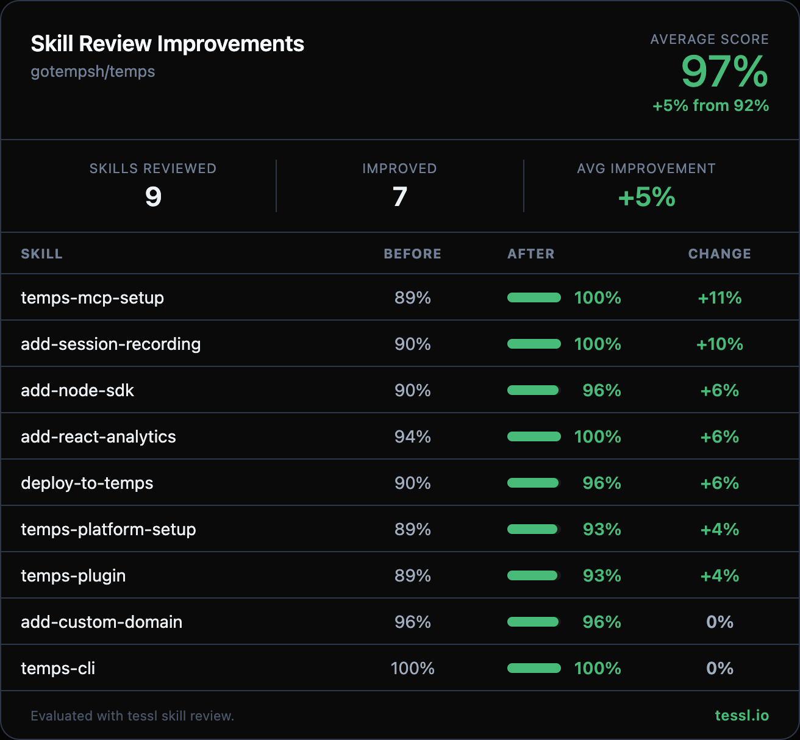

Hey 👋 @dviejokfs

I ran your skills through `tessl skill review` at work and found some targeted improvements. Here's the full before/after:

| Skill | Before | After | Change |
|-------|--------|-------|--------|
| temps-mcp-setup | 89% | 100% | +11% |
| add-session-recording | 90% | 100% | +10% |
| add-node-sdk | 90% | 96% | +6% |
| add-react-analytics | 94% | 100% | +6% |
| deploy-to-temps | 90% | 96% | +6% |
| temps-platform-setup | 89% | 93% | +4% |
| temps-plugin | 89% | 93% | +4% |
| add-custom-domain | 96% | 96% | +0% |
| temps-cli | 100% | 100% | +0% |

## Description

Improves skill quality scores across 7 of 9 skills (average +5%, from 92% to 97%). Two skills were already at ceiling — `temps-cli` (100%) and `add-custom-domain` (96%) — and received no or minimal changes.

## Type of change

- [ ] Bug fix (non-breaking change that fixes an issue)
- [x] New feature (non-breaking change that adds functionality)
- [ ] Breaking change (fix or feature that would cause existing functionality to change)
- [x] Documentation update

Changes made

**temps-mcp-setup (+11%)** — Consolidated 3 duplicate JSON config blocks into a single template with a per-client path table. Collapsed tool/prompt docs and troubleshooting into compact tables.

**add-session-recording (+10%)** — Added 3 validation checkpoints (peer deps, network requests, masking replay test). Consolidated redundant privacy examples into a single unified section. Enhanced final verification with GDPR consent check.

**add-node-sdk (+6%)** — Removed duplicate SDK initialization block. Added 4 validation checkpoints (env vars, dashboard, KV round-trip, blob URL). Tightened verbose lead-in text and condensed Best Practices.

**add-react-analytics (+6%)** — Added validation checkpoint after framework setup (console errors + network tab check). Added section separators for progressive disclosure. Tightened verification checklist.

**deploy-to-temps (+6%)** — Added 5 validation checkpoints across the deployment workflow. Compressed environment variables section. Converted troubleshooting to a compact table.

**temps-platform-setup (+4%)** — Removed Table of Contents and "What it does" explanatory lists. Added validation checkpoints after every major step (14 total). Consolidated CLI install options and auth methods.

**temps-plugin (+4%)** — Fixed description format (`>` → `|`). Integrated all 6 Common Gotchas into their relevant workflow steps. Added validation checkpoints to Build & Deploy and Testing sections.

**add-custom-domain (+0%)** — Added validation checkpoints (dashboard status check, `dig` command for DNS verification). Added section separators. Score unchanged due to progressive disclosure ceiling.

## Checklist

- [ ] I have written tests that cover the changes
- [x] All new and existing tests pass (`cargo test --lib`)
- [x] `cargo check --lib` passes with no warnings
- [x] My commits follow the [Conventional Commits](https://www.conventionalcommits.org/) format
- [x] I have updated documentation where necessary

## Related issues

N/A — proactive quality improvement.

---

Honest disclosure — I work at @tesslio where we build tooling around skills like these. Not a pitch - just saw room for improvement and wanted to contribute.

Want to self-improve your skills? Just point your agent (Claude Code, Codex, etc.) at [this Tessl guide](https://docs.tessl.io/evaluate/optimize-a-skill-using-best-practices) and ask it to optimize your skill. Ping me - [@rohan-tessl](https://github.com/rohan-tessl) - if you hit any snags.

Thanks in advance 🙏
